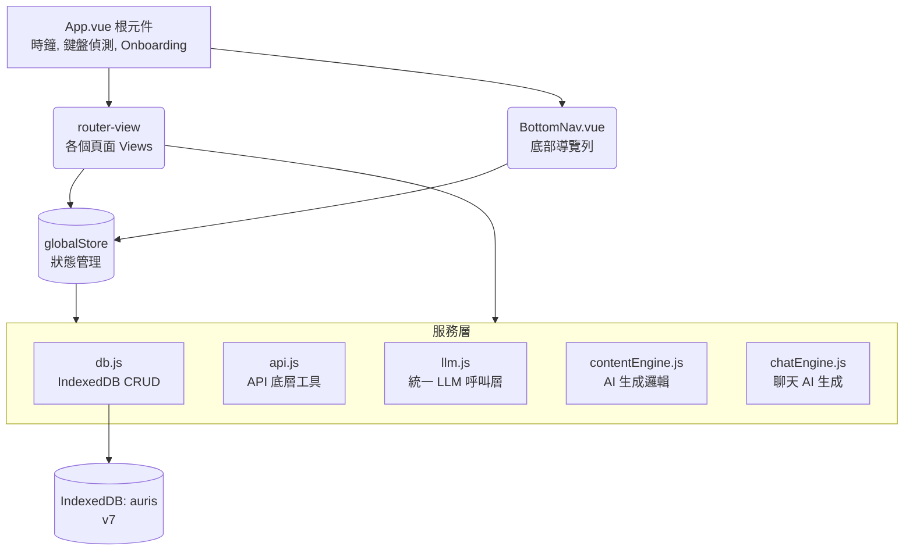

# Auris — 架構規格說明

> 維護這份文件的原則：每次新增頁面、服務、或重要設計決策時一起更新。  
> 最後更新：2026-07-12（P109）

---

## 目錄

1. [整體架構](#1-整體架構)
2. [資料流向](#2-資料流向)
3. [IndexedDB 資料庫](#3-indexeddb-資料庫)
4. [Services 服務層](#4-services-服務層)
5. [Store 全局狀態](#5-store-全局狀態)
6. [Router 路由](#6-router-路由)
7. [Views 頁面](#7-views-頁面)
8. [Components 元件與 UI 系統](#8-components-元件與-ui-系統)
9. [CSS 樣式系統](#9-css-樣式系統)
10. [維護注意事項](#10-維護注意事項)
11. [新增頁面標準流程](#11-新增頁面標準流程)
12. [版本更新紀錄](#12-版本更新紀錄)

---

## 1. 整體架構



---

## 2. 資料流向

### 頁面讀取資料
1. View `onMounted` 階段
2. 呼叫 `globalStore.loadCharacters()` 更新全局角色列表
3. 呼叫 `dbAll('xxx')` 或 `dbIdx('xxx', ...)` 讀取頁面所需的資料
4. 渲染至畫面

### 使用者操作寫入資料
1. 使用者觸發動作 (e.g. 點擊按鈕)
2. View 方法呼叫 `dbPut('xxx', data)` 寫入 IndexedDB
3. (若角色變動) 呼叫 `globalStore.loadCharacters()`
4. 更新 local ref 以立即反映 UI 變更

### AI 生成流程
1. 使用者點擊「生成」或傳送訊息
2. View 呼叫 `contentEngine` 或 `chatEngine` 相關生成函式
3. 服務層讀取 `getSetting` 取得 API 參數與金鑰
4. 讀取所需角色資料 (`dbGet`) 並組合 Prompt
5. 透過 `fetchWithTimeout` 呼叫外部 API (OpenAI/Anthropic/Google)
6. 解析回應後，透過 `dbPut` 存入 DB
7. 回傳結果，View 將新資料推入畫面列表 (無須重新讀取 DB)

---

## 3. IndexedDB 資料庫

**資料庫名稱**：`auris`　**版本**：v7

| 資料表 | keyPath | 索引 | 說明 |
|--------|---------|------|------|
| `characters` | `id` | `worldId` | 角色完整設定（軟欄位：作息 `workTime`/`workPlace`/`restTime` P62、`scheduleTriggers` 時段 P66、`autoSummarize`/`autoSumEvery`/`lastAutoSumAt` P62、`proactiveMute` 主動訊息總開關 P80、`examples` 範例對話 few-shot P88、`weatherAware` 天氣感開關 P95、`busyRead` 已讀不回開關 P96） |
| `messages` | `id` | `charId`, `createdAt`, `charId_createdAt`（複合，P98） | 單人聊天訊息（軟欄位：`image` 圖片 base64 P65、`reaction` 表情 P62、`readAt` 已讀時間戳 P96、`type:'touch'`＋`touchAction` 輕觸動作訊息 P96、`kind:'touch'` 輕觸回應 P96）。複合索引 `charId_createdAt`（v7）供背景派發用 cursor 取「某角色最新 N 則」與計數，取代全量 getAll |
| `memories` | `id` | `charId` | Heart Voice 心聲記錄 |
| `moments` | `id` | `charId`, `createdAt` | 貼文（含 likes/comments） |
| `diary` | `id` | `charId`, `date` | 日記（`date` 格式：YYYY-MM-DD） |
| `dreams` | `id` | `charId` | 夢境 |
| `worlds` | `id` | — | 世界書詞條庫（P65）；多世界系統 `worldId` 索引預留 |
| `groups` | `id` | — | 群組設定 |
| `group_messages` | `id` | `groupId`, `createdAt` | 群組訊息 |
| `notifications` | `id` | `charId`, `createdAt` | 通知記錄 |
| `chat_memories` | `id` | `charId` | 長期記憶條目（P48）|
| `wishes` | `id` | `charId` | 共同願望清單項目（P77）；schema：`{ id, charId, text, done, createdAt }` |
| `notes` | `id` | `charId` | 共同備忘錄項目（P77）；schema 同 `wishes` |
| `settings` | `key` | — | 系統設定（key-value） |

### Settings 常用 key

| key | 說明 |
|-----|------|
| `api_key` | API 金鑰 |
| `api_provider` | `'openai'` / `'anthropic'` / `'google'` / `'vertex'` / `'openrouter'` |
| `api_model` | 模型名稱字串 |
| `api_base` | 自訂 API 位址（空 = 用預設） |
| `theme` | 主題名稱（`cream` / `warm` / `dark` / `gray` / `ocean` / `matcha`） |
| `me_settings` | 使用者自身設定物件（名字、年齡、個性等）；玩家頭像 `avatar`（emoji 或圖片 base64，P62）；生理期欄位 `cycleEnabled` / `lastPeriodStart` / `cycleLength` / `periodLength`（P59，全本地）；玩家作息欄位 `workTime` / `workPlace` / `restTime`（P63） |
| `onboarding_done` | `true` = 已完成新手引導 |
| `last_auto_gen_date` | 最後一次自動生成日期（`YYYY-MM-DD`），防重複觸發 |
| `last_seen_announcement` | 最後看過的更新公告版本（P53），用於決定是否彈出公告 |
| `chat_format_style` | 聊天動作排版開關（P78），`true` 時 `*動作*` 渲染成斜體旁白、`「對話」`上色 |
| `cycle_care_<charId>` | 各角色最後一次生理期主動關心的日期（P59），per-char 去重；P98 起改「生成成功後才寫」 |
| `last_proactive_<charId>` | 各角色最後一次主動訊息的時間戳（P79），背景派發的 3 小時 min-gap 依此判斷 |
| `miss_you_<charId>` / `daily_q_<charId>` | 各角色「我想你」「每日一問」當天已處理的去重 key（日期字串，P74/P79）；`daily_q_` 於 P98 改「生成成功後才寫」，`miss_you_` 維持「擲過骰即寫」（刻意） |
| `cycle_care_try_<charId>` / `daily_q_try_<charId>` | 生理期關心／每日一問當日重試計數（P98）：`{ date, count }`，同日最多嘗試 3 次，達上限視同已發 |
| `sched_sent_<charId>_<time>_<date>` | 作息時段提醒當天去重 key（P66），同一時段一天只發一次；P98 起改「生成成功後才寫」 |
| `sched_try_<charId>_<time>_<date>` | 作息提醒當日重試計數（P98）：數字，同時段一天最多嘗試 3 次；與 `sched_sent_` 一併每日清 7 天前舊 key |
| `sched_cleanup_date` | 最後一次清理 `sched_sent_`/`sched_try_` 舊 key 的日期（P98），一天只清一次 |
| `weather_loc` | 天氣感知的所在位置（P95）：`{ lat, lon, city, fetchedAt }`，全域共用、僅本機；空 = 未設定，天氣不注入 |
| `mood_log` | 心情打卡紀錄（P96）：`{ 'YYYY-MM-DD': { mood, note } }`，寫入時自動清 60 天前舊紀錄；當天沒打卡＝不注入 |
| `pending_busy_reply_<charId>` | 已讀不回的待補回覆（P96）：`{ dueAt, queuedAt, msgId }`；聊天室開著由房內計時器補回、離房由 `App.vue` 背景派發補生成，取消/完成後清除 |
| `last_backup_at` | 最後一次備份的時間戳（P105）：匯出／匯入成功皆更新；距今 ≥ 14 天首頁跳備份提醒卡，從未備份且訊息 ≥ 50 也提醒 |
| `backup_snooze_until` | 備份提醒「稍後」的壓制期限時間戳（P105）：按稍後 = 現在 + 3 天 |
| `keepsakes` | 回憶收藏盒（P106）：收藏訊息**快照**陣列 `{ id, msgId, charId, charName, role, content, note, msgAt, savedAt }`——存快照不存引用，清空聊天後收藏仍在；`msgId` 用於重複收藏去重 |

> [!WARNING]
> **升版注意**：升版（`version` 數字 +1）只能「新增」資料表或索引，不能修改已有結構。修改已有 store 的結構必須刪掉重建，**會清空該 store 的資料**。

---

## 4. Services 服務層

### `services/db.js`
IndexedDB 的所有讀寫操作都走這裡，絕對不要在 View 裡直接操作原生 `indexedDB`。

| 函式 | 用途 |
|------|------|
| `initDB()` | 開啟/升版資料庫，`main.js` 啟動時呼叫 |
| `dbPut(store, value)` | 新增或更新一筆（keyPath = `id` 或 `key`） |
| `dbGet(store, key)` | 讀取單筆 |
| `dbAll(store)` | 讀取全部 |
| `dbIdx(store, indexName, value)` | 用索引查詢多筆 |
| `dbIdxCount(store, indexName, value)` | 用索引計數（不撈本體，P98 背景派發判斷「訊息數 ≥ N」用） |
| `dbCount(store)` | 整個 store 計數（P105：備份提醒門檻、診斷匯出的角色/訊息數） |
| `dbLatestByChar(charId, n)` | 用複合索引 `charId_createdAt` 逆向 cursor 取某角色最新 N 則（舊→新，P98）；取代全量 getAll+sort |
| `dbDel(store, key)` | 刪除單筆 |
| `getSetting(key)` | 讀取 settings |
| `setSetting(key, value)` | 寫入 settings |

### `services/api.js`
API 請求的底層工具（供 `llm.js` 引用）。

| 函式 | 用途 |
|------|------|
| `fetchWithTimeout(url, opts, ms)` | 帶逾時設定的 fetch，合併外部 `signal`，abort 後拋 `'request_timeout'` |
| `getVertexToken(sa)` | Vertex AI OAuth2 token（含模組級快取，仿天氣快取） |
| `getDefModel(provider)` | 各 provider 未填 `api_model` 時的預設模型 |
| `isReasoningModel(model)` | 判定 GPT-5/o 系列推理型（不送取樣參數） |
| `sendLLMRequest(messages, config)` | 非串流一次性請求的**薄包裝**，內部轉呼 `llm.js` 的 `callLLM({ stream:false })` |

### `services/llm.js`（P99）
**統一 LLM 呼叫層**——所有 provider（openai / anthropic / google / openrouter / vertex）的「請求組裝＋回應解析」唯一來源。P99 前，五叉分支被複製在 5 個呼叫點（聊天串流、主動訊息串流、touch/busy 共用串流、群聊串流、`sendLLMRequest`）；收斂後新增 provider 或改 header 只需動這一個檔案。

| 函式 | 用途 |
|------|------|
| `callLLM(opts)` | 單一入口，回傳 `{ fullText, truncated }`。`opts`：`system`（字串或 blocks 陣列 `[{ text, cache }]`，cache 只對 anthropic 生成 `cache_control`，其餘 join 成字串）、`messages`、`maxTokens`、`temperature`（anthropic 與推理型一律不送）、`stream`（vertex 不支援串流→一次回、`onChunk` 收整段）、`onChunk`／`onStart`（HTTP OK 後、讀串流前）／`signal`、`image`（base64 多模態，附最後一則 user）、`extra`（frequency/presence penalty，僅 openai 非推理型帶上） |
| `resolveLLMConfig()` | 讀 settings 解析 `{ provider, model, base, apiKey }`（base 去尾斜線、套預設） |
| `getDefBase(provider)` | 各 provider 未填 `api_base` 時的預設端點 |
| `parseSSEStream(res, provider, onChunk)` | anthropic／OpenAI 相容兩種 SSE 協定解析，回 `{ truncated }` |

> [!NOTE]
> **Gemini 相容性**：Gemini 不支援 `frequency_penalty` / `presence_penalty`，`callLLM` 只在 `provider==='openai'` 時帶上 penalty。
> **循環引用**：`api.js` ↔ `llm.js` 互相 import，但雙方都只在函式體內（呼叫時）使用對方，模組載入時無 top-level 相依，Vite/Rollup 安全處理。

### `services/format.js`
共用文字處理。`formatContent(str, enableRich = false)`：escape `&`/`<`/`>` 後將 `\n` 轉 `<br>`，並清洗夾在中文字／標點之間的孤立換行（P56）；`enableRich`（P78，聊天室／群組傳入）時於 escape 後把 `*動作*` 轉 `<em class="msg-action">`、`「對話」` 轉 `<span class="msg-quote">`。全站各 v-html 渲染點（6 個檔案：ChatRoomView／GroupRoomView／PostDetailView／DiaryDetailView／DreamDetailView／BlackboxView）統一引用，避免某處漏 escape 形成 stored XSS（P55 抽出）。另 `splitReply(text, maxSegments)`（P82）依空行把 AI 一次回覆切成多則短訊息（真人連發短泡泡）；無空行回單段。

### `services/tokens.js`（P88）
`estimateTokens(text)`：token 粗估（CJK≈0.6、英數≈0.25 tok/字）。前端無各家真實 tokenizer，採保守啟發式（寧可高估），供記憶用量顯示與注入預算控管（如 `MEM_TOKEN_BUDGET`）。

### `services/cycle.js`（P59）
生理期週期計算，全本地、不上傳。

| 函式 | 用途 |
|------|------|
| `getCyclePhase(me)` | 依 `lastPeriodStart` + `cycleLength`(預設28) + `periodLength`(預設5) 推算今天落在 `period`/`pms`/`ovulation`/`normal`，回傳含 `dayNum`/`daysUntilNext` |
| `cycleCareContext(phase)` | 依階段組裝注入 system prompt 的關心 context（僅 period/pms 有內容） |
| `cyclePhaseLabel(phase)` | UI 預覽用的階段中文標籤 |

### `services/mood.js`（P96）
心情打卡，仿 `cycle.js` 的「資料＋context 注入」小服務，全本地。

| 函式 | 用途 |
|------|------|
| `MOODS` | 5 種心情常數：開心😊／平靜😌／累了😴／低落😞／煩躁😤 |
| `getTodayMood()` / `setTodayMood(key, note)` | 讀寫 settings `mood_log` 的當日紀錄（同日覆寫＝修改；寫入時清 60 天前舊 key） |
| `moodContext(entry)` | 給 `chatEngine` 注入用：組「對方今天的心情」context（措辭比照生理期關心：自然體貼、不句句提及）；沒打卡回 `''` |

### `services/weather.js`（P95）
天氣感知，全靠免費、免 key 的外部 API，純前端直打。

| 函式 | 用途 |
|------|------|
| `getWeatherCtx()` | 給 `chatEngine` 注入用：讀 `weather_loc` → 取天氣 → 回一行克制的 context 字串（強調「偶發提及」）；未定位或失敗回 `''` |
| `geocodeCity(name)` | 城市名 → `{ lat, lon, city }`（手動輸入備案），Open-Meteo geocoding |
| `reverseGeocode(lat, lon)` | 座標 → 城市名（自動定位後顯示用），BigDataCloud 免 key 反查；失敗回 `''` |
| `weatherCodeToZh(code)` | WMO weather_code → 中文天氣詞 |

> 內含模組級快取（仿 `api.js` 的 Vertex token 快取）：同座標 30 分鐘內不重打天氣 API。

### `services/backup.js`（P105）
就地備份＋備份提醒判斷，匯出邏輯抽自 SettingsView（設定頁與首頁提醒卡共用）。

| 函式 | 用途 |
|------|------|
| `doBackup()` | `exportAllData()` → JSON 下載檔（檔名帶時間戳、不含 API 金鑰），成功即 `markBackedUp()` |
| `markBackedUp()` | 寫 settings `last_backup_at`＝現在（匯出／匯入成功都呼叫） |
| `snoozeBackupReminder()` | 「稍後」：寫 `backup_snooze_until`＝現在＋3 天 |
| `shouldRemindBackup()` | 首頁提醒卡判斷：snooze 期內回 `null`；從未備份且訊息 ≥ 50 回 `{ kind:'first' }`；距上次 ≥ 14 天回 `{ kind:'overdue', days }` |

### `services/diag.js`（P105）
診斷匯出——本地錯誤日誌＋一鍵匯出，降低 bug 回報來回成本（P103 教訓）。錯誤存 **localStorage**（同步、不依賴 IndexedDB，連 DB 初始化失敗都記得下來），只存這台裝置。

| 函式 | 用途 |
|------|------|
| `logError(src, msg)` | 記一筆錯誤進 ring buffer（30 筆、逐筆蓋當時 `APP_VERSION`、訊息截 300 字元）；自身絕不拋錯 |
| `getErrors()` | 讀 ring buffer（損毀／非陣列回 `[]`） |
| `installGlobalErrorLog()` | `main.js` 啟動時掛 `error`／`unhandledrejection` 全域監聽 |
| `exportDiag()` | 組診斷純文字：版本＋UA＋螢幕/dpr＋PWA standalone＋主題＋provider/模型名＋角色/訊息計數＋最近錯誤；**絕不含訊息內容與 API 金鑰**。SettingsView「複製診斷資訊」用（剪貼簿為主、下載 .txt 備援） |

> 錯誤來源三路：全域監聽（`window`/`promise`）、`initDB` 失敗（`init`）、`callLLM` 失敗（`llm`，provider/model＋錯誤訊息含 HTTP 狀態；AbortError 使用者主動中斷不記）。

### `services/speech.js`（P106；P108 起 UI 暫下架）
訊息朗讀（TTS 輕量版）——`speechSynthesis` 純前端免費。**P108 起聊天室選單已移除「朗讀」**（iOS 中文系統音太機械、不符體驗標準）；引擎與測試保留，待接高品質 TTS API（BYOK）時復用。

| 函式 | 用途 |
|------|------|
| `speakText(text)` | 停掉前一段後朗讀；zh-TW 語音優先、語速 0.95 |
| `stripActionText(text)` | 剝除全形/半形括號內的動作描寫再唸；剝完沒剩東西則回原文 |
| `stopSpeak()` / `isSpeaking()` / `speechSupported()` | 停止／狀態／環境支援判斷（不支援時聊天室選項不出現） |

### `services/keepsakes.js`（P106）
回憶收藏盒——長按訊息「收藏成回憶」的快照 CRUD，存 settings `keepsakes`（見 §3）。V1 不注入 prompt（未來可作 D4 默契素材）。

| 函式 | 用途 |
|------|------|
| `addKeepsake({...})` | 存快照（備註去頭尾空白）；空內容或同 `msgId` 已收藏回 `null` |
| `listKeepsakes(charId?)` | 新→舊；帶 `charId` 只回該角色 |
| `removeKeepsake(id)` / `updateKeepsakeNote(id, note)` | 刪除／改備註 |

### `services/shareCard.js`（P106）
對話分享卡——canvas 生成對話美圖卡（1080px 寬、高度隨內容），隱私型產品的自然傳播管道。配色讀當前主題 CSS 變數（6 款主題自動跟色）；CJK 逐字貪婪換行、連續拉丁字串不拆；浮水印「Auris」＋網址小字淡色。D1 回憶月報存圖未來共用此引擎。

| 函式 | 用途 |
|------|------|
| `renderShareCard({ messages, charName, dateText })` | 回 canvas：header（名字＋日期）＋左右泡泡（assistant 左 surface／user 右 rose）＋浮水印 |
| `shareCardImage(canvas, filename)` | `navigator.share` 檔案分享 → 不支援落 PNG 下載；回 `'shared'`/`'downloaded'`/`'cancelled'`（使用者收掉面板不當錯誤） |

### `services/contentEngine.js` 與 `chatEngine.js`
AI 內容與對話生成邏輯：

- `contentEngine.js`：負責生成貼文 (`generatePost`)、日記 (`generateDiary`)、夢境 (`generateDream`) 以及留言回覆 (`generateCommentReply`)。每次生成成功後會同步寫入 `notifications` store，讓通知頁顯示新動態。**P56 起**：`generatePost` 與 `generateDream` 在 prompt 中加入最近 6–8 則聊天紀錄 context；**P60**：三處重複的近期對話組裝提取為 `buildRecentChat()` 工具函式。**P93 起**：貼文生成抽出 `buildPostContent(c)`、回覆生成抽出 `buildReplyText(post,char,threadComments)`（含「留言者＝貼文對象本人」身份綁定），並新增就地重生用的 `regeneratePost(postId)` 與 `regenerateCommentReply(postId, replyIdx)`。
- `chatEngine.js`：核心對話引擎，主要函式：
  - `generateAIResponseStream` — 一對一串流回覆，完成後觸發 Heart Voice
  - `generateGroupAIResponseStream` — 群組串流回覆，支援 `onStart`（切換動畫）與 `onChunk`（逐字更新）
  - `generateProactiveMessageStream` — 主動訊息串流，配合背景計時器使用；**P56 起**：主動訊息落地後會寫入 `notifications`（`type: 'chat'`），通知中心可查
  - `summarizeToMemory` — 將近期對話濃縮為 `chat_memories` 條目；**P62 起**：可由 `ChatRoomView.maybeAutoSummarize()` 在達 `autoSumEvery` 門檻時背景自動觸發
  - `generateHeartVoice` — 機率性生成說不出口的心聲，寫入 `memories` 並發出 `new-heart-voice` 事件與通知
  - `generateCycleCareMessage` — 生理期主動關心（P59），非串流生成關心訊息 → 存 assistant 訊息 + `unreadCount++` + `type:'chat'` 通知
  - `generateScheduleMessage` — 作息時段主動訊息（P66），由 `App.vue` 每 5 分鐘掃 `scheduleTriggers`，命中時段且當天未發過才觸發
  - `generateMissYouMessage`（P74）／`generateDailyQuestion`（P74）— 「我想你」短訊與「每日一問」，非串流，由 `App.vue` `runProactiveDispatch` 觸發
  - `generateTouchResponseStream`（P96）— 輕觸互動回應：動作訊息已入 history，追加「對動作本身反應、1～2 句」指示串流生成，落庫 `kind:'touch'`
  - `generateBusyReplyStream`（P96）／`shouldBusyRead(c)`（P96）／`processDueBusyReply(charId)`（P96）— 已讀不回三件組：補回生成（追加「稍早在忙、已讀沒回，現在補回」指示）；觸發擲骰（基礎 15%、`workTime` 解析出 HH:MM–HH:MM 且命中提至 40%、深夜不觸發）；背景補發（到期的 pending 非串流補生成＋未讀＋通知＋`new-proactive-msg` 廣播）。三者共用新抽出的 `streamWithSystem()` 串流 helper
  - **主動訊息共用層**（P79–P81）：`isRecentlyActive(allMsgs)`（最後一則非 hv 距今 < 5 分鐘＝熱聊）、`buildProactiveHistory(history, task, active)`（指令放對話最尾端＋熱聊/冷場分支）、`PROACTIVE_KINDS`／`hasUnrepliedProactive(charId)`（防堆疊閘門）、`proactiveTimeAnchor()`（P81，**不依賴 `timeAware`**，強制注入當下時段，杜絕「早上問午餐」）、`PROACTIVE_NO_NARRATION`（P81，禁止主動訊息寫場景旁白）；5 個主動生成函式皆套用。4 個背景生成器寫入訊息後 `dispatchEvent('new-proactive-msg')`，供開著的 `ChatRoomView` 即時 `loadMessages`（P81）
  - **世界書注入**（P65）：`buildAIChatSetup` 掃描近 10 則訊息，命中詞條名稱／別名才把對應 `worlds` 詞條注入 system prompt（`worldCtx`），不觸發不佔 token
  - **圖片識別**（P65）：`sendUserMessage` 加 `image` 參數、`generateAIResponseStream` 加 `imageBase64`，`buildImgHistory()` 依 provider 轉成 Anthropic／OpenAI／Vertex 各自的圖片 content 格式
  - **角色作息注入**（P62）：`buildAIChatSetup` 組 `scheduleCtx`（角色 `workTime`/`workPlace`/`restTime`，接在 `timeCtx` 後），請角色依現在時間推測自身狀態；與 P63 的玩家作息 `playerScheduleCtx` 互補
  - **生理期被動體貼**（P59）：`buildAIChatSetup` 在角色 `cycleCare` 開啟且階段為 period/pms 時，將 `cycleCareContext()` 注入 system prompt（其餘階段為空字串）
  - **玩家作息注入**（P63）：`buildAIChatSetup` 新增 `playerScheduleCtx`，讀 `me_settings.workTime`/`workPlace`/`restTime`，告知角色對方當前可能狀態（上班中／休息中），讓主動訊息語氣符合情境
  - **時間間隔 Bug 修正**（P67）：`buildAIChatSetup` 計算「距上次對話間隔」時，`allMsgs` 末位是剛送出的使用者訊息（時間差近 0），改用 `allMsgs[length-2]` 作為比較基準，正確偵測跨天間隔並注入時間流逝提示。
  - **API Error Handling**：支援 Array 格式 Proxy 錯誤捕捉；群組放寬 `max_tokens: 4000`；生成錯誤時以「【系統偵錯】」訊息顯示於畫面；**P60**：串流回應為空時改顯示明確 toast，不再靜默消失。
  - **群組玩家名字**：`buildGroupChatSetup` 使用 `getSetting('me_settings')` 讀取玩家資料（P56 修正 key 錯誤）；model fallback 用 `getDefModel(provider)`（P60 修正寫死 bug）。

---

## 5. Store 全局狀態

**檔案**：`store/index.js`  
使用 Vue 3 `reactive()` 實作，不依賴 Pinia 以保持輕量。

```javascript
globalStore = {
  theme: 'cream',          // 當前主題，綁到 App.vue data-theme
  characters: [],          // 所有角色陣列，各頁面共用
  keyboardOffset: 0,       // 鍵盤高度（px），用於 BottomNav 隱藏判斷
  chatFormatStyle: false,  // 聊天動作排版開關（chat_format_style），控制 *斜體*／「」上色

  init()             // App.vue onMounted 呼叫
  loadCharacters()   // 重新從 DB 載入 characters（各 View onMounted 呼叫）
}
```

---

## 6. Router 路由

**檔案**：`router/index.js`  
使用 `createWebHistory`（需配合 GitHub Pages 的 404 重導機制）。

| 路由 | name | BottomNav 顯示 |
|------|------|---------------|
| `/` | `home` | ✅ |
| `/chat-list` | `chat-list` | ✅ (對話 tab) |
| `/chat/:id?` | `chat` | ❌ 隱藏 |
| `/moments` | `moments` | ✅ (貼文 tab) |
| `/post/:id` | `post-detail` | ❌ 隱藏 |
| `/diary` | `diary` | ✅ |
| `/diary/:id` | `diary-detail` | ❌ 隱藏 |
| `/dream` | `dream` | ✅ |
| `/dream/:id` | `dream-detail` | ❌ 隱藏 |
| `/group-list` | `group-list` | ✅ (對話 tab) |
| `/group-room/:id?` | `group-room` | ❌ 隱藏 |
| `/group-create` | `group-create` | ❌ 隱藏 |
| `/blackbox` | `blackbox` | ✅ |
| `/notifications` | `notifications` | ✅ |
| `/me` | `me` | ✅ (我的 tab) |
| `/settings` | `settings` | ✅ (我的 tab) |
| `/api` | `api` | ❌ 隱藏 |
| `/lock` | `lock` | ❌ 隱藏 |
| `/onboarding` | `onboarding` | ❌ 隱藏 |
| `/char-manage` | `char-manage` | ❌ 隱藏 |
| `/char-edit/:id?` | `char-edit` | ❌ 隱藏 |
| `/worlds` | `worlds` | ❌ 隱藏（設定頁進入，P65） |
| `/worlds/edit/:id?` | `worlds-edit` | ❌ 隱藏（P65） |
| `/relation/:id` | `relation` | ❌ 隱藏（聊天室選單進入，P71） |
| `/together/:id` | `together` | ❌ 隱藏（關係主頁／聊天室選單進入，P77；共同願望清單・備忘錄） |
| `/memories/:id` | `memories` | ❌ 隱藏（關係主頁進入，P106；回憶收藏盒） |

> 共 26 條路由。

---

## 7. Views 頁面

### 頁面標準結構

每個 View 的 `<template>` 都應遵循此架構：

```html
<div class="page active" id="pg-xxx">
  <!-- 頁首 -->
  <div class="ph">
    <div class="ph-back" @click="$router.push('...')">返回</div>
    <div class="ph-title">標題</div>
    <div class="ph-act">右側動作</div>
  </div>

  <!-- 主要內容區 -->
  ...
</div>
```

### 關鍵 View 說明

- **ChatRoomView (單人聊天)**：串流逐字輸出（`generateAIResponseStream`）、長按訊息選單（複製／編輯重傳／重新生成）、記憶抽屜（AI 總結、手動新增、編輯、toggle、刪除）、背景主動訊息計時器（`scheduleProactive`）、auto-interrupt 打斷模式。**P62 起**：玩家訊息帶自訂頭像列、長按可加表情反應（`reaction`）、達門檻自動總結（`maybeAutoSummarize()`）。**P65 起**：相機按鈕傳圖（`compressImage()` 壓 512px）、泡泡圖片渲染與 `viewImage()` 全螢幕預覽。**P67 起**：訊息列表在跨日邊界自動插入「M 月 D 日　星期X」分隔標籤（`showDateSep()` / `fmtDateSep()`）。**P76 起**：⋯ 選單重組——加「他的日記」「他的夢境」捷徑（`?char=` 跳轉預選）；清除/匯出/匯入收進「聊天記錄管理」二層選單（`showDataMenu`）。
- **GroupRoomView (群組聊天)**：多角色串流輪替回覆，`@點名` 強制指定角色，角色前綴清洗防止 AI 混淆發言。
- **CharEditView (角色編輯)**：5 個 Tab 切換——基本資訊、個性背景、說話方式、關係設定、進階設定（P72 重整：Tab3「關係與規範」→「關係設定」、Tab4「回覆設定」→「進階設定」，行為規範與 `scheduleTriggers` 移至 Tab4），必須確保 modal CSS 存在以正常顯示彈窗。進階設定含「生理期關心」toggle（`char.cycleCare`，預設 false，P59）、「暫停主動訊息（總開關）」toggle（`char.proactiveMute`，預設 false，P80）與「主動訊息時段」清單（`scheduleTriggers`）。
- **MeView (我的設定)**：玩家自身資料；含「作息 / 行程」區塊（`workTime`/`workPlace`/`restTime`，P63）與「生理期追蹤」區塊（主開關、最近經期開始日、週期長度、經期天數，即時預覽推算階段，P59），資料寫入 `me_settings`。儲存成功後 toast 提示再導頁（P64）。
- **HomeView**：快速入口磚牆（對話、貼文、夢境、黑盒子、通知等），角色橫向捲動快選。**P55 起**：通知 tile 動態讀取 `notifications` store 未讀數，有未讀時顯示玫瑰色 badge 與「X 則未讀」文字。**P75 起**：Widget 化——最近對話卡片（每角色最後一句、未讀、相對時間，點列直入聊天室）、每日一問卡片（當日未回答才顯示）、心聲/日記/夢境/通知活磁磚（最新內容節錄＋計數）、角色列依最後對話時間排序、貼文/群組/世界書降為「更多」捷徑列。
- **MomentsView / PostDetailView**：貼文列表與留言回覆。
- **DiaryView / DiaryDetailView**：日記列表與全文展示。**P76 起**：支援 `?char=` query 預選角色篩選（聊天室「他的日記」入口）。
- **DreamView / DreamDetailView**：夢境列表與全文展示。**P76 起**：新增角色篩選 chips（沿用 `.diary-chip` 樣式）與 `filteredDreams`；支援 `?char=` query 預選篩選與生成對象。
- **BlackboxView**：Heart Voice 心聲記錄。
- **NotificationsView**：顯示貼文／日記／夢境／心聲／主動訊息生成後寫入的通知，點擊跳轉對應頁面。支援 `type`：`post` / `diary` / `dream` / `hv` / `chat`。
- **WorldsView / WorldEditView (世界書，P65)**：與角色脫鉤的全域詞條庫（`worlds` store）。列表頁支援分類篩選與啟用 toggle；編輯頁設定名稱（觸發關鍵字）、別名、分類、內容、適用角色。對話時由 `buildAIChatSetup` 命中關鍵字才注入 prompt。
- **MemoriesView (我們的回憶，P106)**：路由 `/memories/:id`，關係主頁「我們的回憶」入口卡進入；顯示該角色的收藏訊息快照列表（說話者／日期／內容／備註），兩段式刪除（先變「確認刪除」再點才刪）。D1 回憶月報實作時擴成「歷月回顧｜收藏」雙分頁。

---

## 8. Components 元件與 UI 系統

### `BottomNav.vue`
- 使用 `useRoute()` 判斷當前路由。
- `.kb-hidden`：鍵盤拉起時隱藏整個導覽列，優化手機打字體驗。

### Toast 系統
- 取代原生 `window.alert()` 的全域通知系統。
- 在 `App.vue` 實作，掛載於 `<div id="toast" class="toast">`。
- 任何地方（View 或 Service）統一用 `window.toast_('訊息')` 呼叫。
- 可選第二參數毫秒數控制顯示時間（預設 4500ms）。

---

## 9. CSS 樣式系統

**主檔**：`assets/main.css`（集中管理所有樣式）

### 主題系統
透過 `[data-theme="xxx"]` 切換 CSS 變數：
```css
[data-theme="cream"] { --bg: #faf8f5; --rose: #c9826a; }
[data-theme="dark"]  { --bg: #1a1a1a; --rose: #e8907a; }
```

### 常用基礎 Class
| Class | 說明 |
|-------|------|
| `.page` | 頁面根容器，設定為滿版及垂直捲動 |
| `.ph` | 頁首 (Page Header) |
| `.empty-cta` | **空狀態的行動按鈕（玫瑰色背景，專屬）** |
| `.btn-primary` | 深色主要按鈕（如聊天發送） |
| `.modal-overlay` / `.modal-box` | 彈窗遮罩與底部升起內容區 |

---

## 10. 維護注意事項

1. **刪除關聯資料**：在刪除角色時，必須同步清除所有帶有該 `charId` 的資料表：`messages`, `memories`, `chat_memories`, `moments`, `diary`, `dreams`, `notifications`, `wishes`, `notes`（見 `CharManageView.confirmDelete`）。
2. **新增設定項目**：直接透過 `setSetting('new_key', value)` 新增即可，不需修改資料庫結構。
3. **空狀態原則**：遇到尚未開發或空列表時，按鈕一律使用 `.empty-cta` 而非 `.btn-primary`，且未完成的功能應掛上 `@click="$toast('尚在開發，敬請期待')"`。
4. **`.page` 內不要用 `position:fixed`**（P107 教訓）：`.page` 帶 `transform` 轉場，fixed 後代會退化成相對 `.page` 內容定位、跟著捲動跑位。頁內底部停靠列用 `position:sticky; bottom:0`；全螢幕遮罩／sheet 類請 `Teleport to="body"` 或確認該頁不整頁捲動。
5. **主題色只掛在 `#phone-container [data-theme]`**（P107 教訓）：JS 讀主題 CSS 變數要 `getComputedStyle(document.getElementById('phone-container'))`，讀 `documentElement` 只會拿到 `:root` 的預設奶白值。

---

## 11. 新增頁面標準流程

1. 建立檔案：`src/views/XxxView.vue`。
2. 註冊路由：在 `router/index.js` 新增路由物件。
3. 控制導覽列：若需隱藏 BottomNav，將路由名稱加入 `App.vue` 的 `hiddenRoutes` 陣列。
4. 設定高光：在 `BottomNav.vue` 中將路由加入對應的 active 判斷邏輯。

---

## 12. 版本更新紀錄

### P109（2026-07-12）分享卡支援整段連發

splitReply 連發泡泡被分享卡截成單顆、語意不連貫。`ChatRoomView` 加 `msgGroupOf(m)`（收集相鄰同角色文字泡泡，遇對方訊息/hv/touch/圖片斷開），分享預設帶整段、可勾選退回單則；`shareCard.js` 同角色相鄰泡泡間距 36→14、圓角尾巴只給連發末顆（比照聊天室群組視覺）。

### P108（2026-07-12）朗讀功能暫時下架

iOS 中文系統語音偏機械、不符體驗標準。只拆 UI：ChatRoomView 長按選單移除「朗讀」項與 speech import；`services/speech.js`＋測試保留（檔頭註記），待高品質 TTS API 復用。

### P107（2026-07-12）P105/P106 測試回饋修正

- **`.bb-manage-bar` fixed → sticky**：`.page` 有 `transform`（轉場動畫）會讓 `position:fixed` 後代退化成相對 `.page` 內容定位，心聲管理刪除列因此卡在列表中段。**通則：`.page` 內的底部停靠列一律用 `position:sticky; bottom:0`，不要用 fixed**。
- **`shareCard.js` 主題色讀取修正**：主題變數掛在 `#phone-container [data-theme]`、不在 `:root`；`themeColors()` 改讀 `#phone-container`（原讀 `documentElement` 永遠拿到預設奶白）。
- **分享卡一問一答限定對方訊息**：`findPrevTextMsg` 加 `role` 相反條件（splitReply 多顆泡泡會讓「前一則」是同一人），卡片必為一左一右兩色；checkbox 文案動態顯示「帶上你／他說的上一句」。
- **心聲語言與拒絕過濾（`chatEngine.js`）**：HV prompt 繁體中文升為獨立鐵則（嚴禁簡體）；存入前過 `isRefusalReply`，杜絕 "I can't help…" 誤存為心聲。

### P106（2026-07-11）泡泡長按選單批：訊息朗讀＋回憶收藏盒＋對話分享卡

「Auris 維運與新功能討論」定案的第二批（B3＋D2＋F1），共同載體＝單聊訊息長按 action sheet。

- **訊息朗讀（新增 `services/speech.js`，見 §4）**：長按 →「朗讀」，`speechSynthesis` zh-TW 優先；`stripActionText` 剝括號動作再唸；離開聊天室 `stopSpeak()`；不支援的瀏覽器選項不出現。
- **回憶收藏盒（新增 `services/keepsakes.js`＋`views/MemoriesView.vue`，見 §4/§7）**：長按 →「收藏成回憶」→ 選填備註（60 字）；存快照不存引用（settings `keepsakes`）、同 `msgId` 去重；入口＝RelationView 新入口卡 →`/memories/:id`（路由 25→26 條）。
- **對話分享卡（新增 `services/shareCard.js`，見 §4）**：長按 →「分享成卡片」→ 預覽 modal（可帶前一則成一問一答——自動跳過 hv/touch 訊息；角色名可切匿名「Ta」；使用者側一律不出現名字）→ `navigator.share`／PNG 下載 fallback。配色隨 6 款主題、浮水印「Auris」＋網址。

| 檔案 | 變更 |
|------|------|
| `services/speech.js` | 新增：`speakText`／`stripActionText`／`stopSpeak`／`speechSupported` |
| `services/keepsakes.js` | 新增：`addKeepsake`／`listKeepsakes`／`removeKeepsake`／`updateKeepsakeNote` |
| `services/shareCard.js` | 新增：`renderShareCard`／`shareCardImage` |
| `views/ChatRoomView.vue` | 長按選單加三項；收藏備註／分享卡預覽 modal；`onUnmounted` 停朗讀 |
| `views/MemoriesView.vue` | 新增：收藏列表頁 |
| `views/RelationView.vue` | 「我們的回憶」入口卡 |
| `router/index.js` | `/memories/:id`（26 條） |
| `__tests__/keepsakes.test.js`／`__tests__/speech.test.js` | 新增 8＋5 案例（vitest 87/87） |

### P105（2026-07-08）維運防線包：備份提醒＋診斷匯出＋群組 prompt caching

「Auris 維運與新功能討論」定案的第一批（M1＋M3＋B1）。

- **版號常數手術（新增 `src/version.js`）**：`APP_VERSION`／`VERSION_NOTE` 為版號全站唯一來源，SettingsView 改引用顯示、診斷日誌逐筆蓋版號。連動：CLAUDE.md、`/bump` skill、`check-version-bump.sh` 改盯 `version.js` diff（實測 hook 仍擋未版更 commit）。
- **診斷匯出（新增 `services/diag.js`，見 §4）**：`logError` ring buffer（localStorage、30 筆）＋`exportDiag` 診斷純文字；`main.js` 掛 `error`/`unhandledrejection`；`callLLM` 包失敗記錄層（AbortError 不記）；SettingsView「資料」組新增「複製診斷資訊」列（剪貼簿為主、下載 .txt 備援）。絕不含訊息內容與金鑰。
- **備份提醒（新增 `services/backup.js`，見 §4）**：匯出邏輯抽自 SettingsView；從未備份且訊息 ≥ 50 或距上次備份 ≥ 14 天 → HomeView 提醒卡（仿 mood-card、「立即備份／稍後」）；稍後 snooze 3 天；匯出／匯入成功皆重置。settings 新增 `last_backup_at`／`backup_snooze_until`。
- **群組 prompt caching（`chatEngine.js`）**：`buildGroupChatSetup` 比照單聊拆 `systemStable`（參與者/人設/規則，設 Anthropic 快取點）＋`systemVolatile`（現在時間/點名提醒，挪到快取點後）——P100 快取覆蓋的最後缺口。
- **`db.js` 新增 `dbCount(store)`**：整店計數。

| 檔案 | 變更 |
|------|------|
| `src/version.js` | 新增：`APP_VERSION`／`VERSION_NOTE` |
| `services/diag.js` | 新增：`logError`／`getErrors`／`installGlobalErrorLog`／`exportDiag` |
| `services/backup.js` | 新增：`doBackup`／`markBackedUp`／`snoozeBackupReminder`／`shouldRemindBackup` |
| `services/db.js` | 新增 `dbCount` |
| `services/llm.js` | `callLLM` 失敗記錄包裝層 |
| `services/chatEngine.js` | 群聊 system 切穩定／易變段＋快取點 |
| `main.js` | `installGlobalErrorLog()`；initDB 失敗記診斷 |
| `views/SettingsView.vue` | 版號引用 version.js；「複製診斷資訊」；匯出走 backup.js、匯入重置計時 |
| `views/HomeView.vue` | 備份提醒卡 |
| `services/__tests__/backup.test.js`／`diag.test.js` | 新增（8＋7 案例，74/74 通過） |

### P104（2026-07-07）{{user}}/{{char}} 佔位符全站替換・心聲截斷再修

- **佔位符替換（`format.js` 新增 `applyNameMacros`）**：專案原本完全沒有 {{user}}/{{char}} 替換層，角色卡欄位裡的佔位符原樣進 system prompt、模型照抄進輸出。雙保險：prompt 端（單聊 systemStable/Volatile、群聊 systemPrompt、contentEngine 四生成器）組完整段換真名；輸出端（`persistReplySegments`、群聊落庫、contentEngine 輸出）存檔前再掃一次。大小寫與空白變體（`{{ USER }}` 等）皆吃。
- **非串流截斷偵測（`llm.js`）**：P94 只在 `parseSSEStream` 偵測截斷，非串流三分支拿到 JSON 從不讀 finish_reason、`truncated` 恆為 false。補上：OpenAI 相容 `finish_reason==='length'`、Anthropic `stop_reason==='max_tokens'`、Vertex `finishReason==='MAX_TOKENS'`。
- **心聲殘句不再入庫（`chatEngine.js` `generateHeartVoice`）**：改直連 `callLLM`（`sendLLMRequest` 會吞掉 truncated），被硬切一律不存不通知；max_tokens 220→1000（推理型模型思考先吃額度，220 仍會把正文斬半、產出「連妳嗔怒的模樣，都」式殘句且閃過 P94 的「<6 字＋逗號結尾」啟發式）。啟發式保留為第二道防線。

| 檔案 | 變更 |
|------|------|
| `services/format.js` | 新增 `applyNameMacros(text, userName, charName)` |
| `services/llm.js` | 非串流三 provider 分支補 finish_reason 截斷偵測 |
| `services/chatEngine.js` | prompt／落庫雙端佔位符替換；心聲直連 callLLM、truncated 即棄、額度 220→1000 |
| `services/contentEngine.js` | 貼文／留言回覆／日記／夢境雙端替換 |
| `services/__tests__/format.test.js` | applyNameMacros 測試組（7 案例，59/59 通過） |
| `views/SettingsView.vue` | P103 → P104 |

### P103（2026-07-05）聊天室排版重診：泡泡雙重壓縮・保留原始分行・主動訊息出戲修正

以「聊天匯出 JSON vs 畫面截圖」對照＋Playwright 重現定位三病根，並**推翻 P56/P101 的「孤立換行」診斷**：

- **泡泡雙重 74% 壓縮（`main.css`）**：`.msg-with-av`（74%）內層 `.msg` 又套 74% → 首顆泡泡上限 196px、比 `.msg-cont`（74%+33px）窄一截；且 shrink-to-fit 父容器×百分比 max-width 子元素的循環收縮讓短句（DB 內無換行）在 3x 亞像素下無故折行——**此即 P56/P101「句中腰斬」的真兇（當年誤診為模型硬換行）**。修法：`.msg-with-av{max-width:calc(74% + 33px)}`＋`.msg-with-av .msg{max-width:none;min-width:0}`；374px 媒體查詢同步 `calc(80% + 33px)`。
- **停止合併孤立換行（`format.js`）**：實證模型單 `\n` 是刻意分行（「今天心情看起來不錯\n做什麼了」為兩句），合併規則反把分行黏成長串。改為保留單一換行，只做 `\r` 正規化、行尾空白清理（`[ \t]+\n → \n`）、`\n{3,} → \n\n`。`format.test.js` 換行組改寫（9 案例，52/52 通過）。
- **主動訊息冷場出戲（`chatEngine.js`）**：`buildProactiveHistory` 冷場分支原指令「不要接續上面的舊話題」＋task「問問近況」＝叫模型失憶，劇情進行中卻傳出「今天做什麼了」式問候。改為「可開新話題但必須與最後情境銜接；若劇情中兩人正在一起，順著『人還在身邊』說話」；task 改「說說你此刻在做什麼或想什麼」。全部主動訊息種類共用此入口。

| 檔案 | 變更 |
|------|------|
| `assets/main.css` | `.msg-with-av` 寬度規則修正（主規則＋374px 查詢） |
| `services/format.js` | 移除孤立換行合併、保留原始分行 |
| `services/__tests__/format.test.js` | 換行測試組改寫為「換行保留（P103）」 |
| `services/chatEngine.js` | 冷場分支 prompt 情境相容化 |
| `views/SettingsView.vue` | P102 → P103 |

### P102（2026-07-04）互動教學示範模式（Demo 沙盒）

複用真實 Vue 畫面元件的教學模式，靠 `?demo=1` 進入。不改現有 view/store 的既有行為，旗標關閉時對正式 App 零影響。

- **旗標（`services/demoMode.js`，新增）**：`isDemo()` 首次見 `?demo=1`（query 或 hash）寫入 sessionStorage 黏著整個分頁（vue-router 導頁常掉 query，故靠 sessionStorage）。另 `demoEntryUrl()`（帶 `BASE_URL`）、`exitDemo()`。
- **資料庫隔離（`services/db.js`）**：`initDB` 開 DB 名稱改 `isDemo() ? 'auris-demo' : 'auris'`。其餘讀寫吃 module 級 `db` 自動隔離，碰不到真實資料（sentinel 實測：demo seed 後真 `auris` characters 仍為 0）。
- **AI 攔截（`services/llm.js`）**：`callLLM` 開頭加 `if (isDemo())` 守衛，回 `demoReply()` 假文字；串流時 `onStart` → 分段 `onChunk`（打字機效果）→ `{ fullText, truncated:false }`。免金鑰、不外連。
- **示範資料（`services/demoData.js`，新增）**：夜雨／小晴示範世界（角色／訊息／心聲／記憶／貼文／日記／夢／通知／世界書／群組／願望／備忘）。`seedDemoIfEmpty()` 在 demo DB 無角色時灌入，並設 `onboarding_done`＋`last_seen_announcement='P100'` → App.vue 引導與公告判斷自然略過（免改 App.vue）。`demoReply({ system, messages })` 依 system 關鍵字（日記／夢／貼文／心聲／總結／每日一問）回對應題材，預設回聊天語氣。
- **教學面板（`components/DemoTeachingPanel.vue`＋`services/demoGuideContent.js`，新增）**：`main.js` demo 分支於主 app mount 後，另建節點把面板當第二個 Vue app 掛上（共用同一 router 讀 `route.name`），完全不動 App.vue。角落浮動「教學」鈕，開啟底部面板顯示當前頁的螢幕感知說明（route name → `{ title, body[] }`，文案取自使用手冊）。面板根綁 `globalStore.theme` 的 `data-theme` 以正確套用主題色。
- **入口**：`SettingsView.vue` 加「使用教學」列（另開分頁進 `?demo=1`）；或直接用 `?demo=1` 網址（可放官網／分享）。

| 檔案 | 變更 |
|------|------|
| `services/demoMode.js` | 新增：`isDemo` / `demoEntryUrl` / `exitDemo` |
| `services/demoData.js` | 新增：示範 seed＋`seedDemoIfEmpty`＋假 AI `demoReply` |
| `services/demoGuideContent.js` | 新增：route→螢幕感知教學文案＋fallback |
| `components/DemoTeachingPanel.vue` | 新增：浮動教學鈕＋底部螢幕感知面板 |
| `services/db.js` | `initDB` 開 DB 名稱依 `isDemo()` 切 `auris-demo` |
| `services/llm.js` | `callLLM` 開頭加 demo 假回覆守衛（相容串流/非串流） |
| `main.js` | demo 分支：mount 前 seed、mount 後掛載教學面板 |
| `views/SettingsView.vue` | 「使用教學」入口列；版號 P101 → P102 |

### P101（2026-07-04）聊天室排版修復：氣泡配色・句中換行・主動訊息切泡泡・拒絕回覆

- **句中孤立換行合併升級（`format.js`）**：`formatContent` 的換行清洗改先正規化 `\r\n`／`\r`→`\n`，合併規則容忍換行前後空白、改用 lookahead 不吃右側字元（連續單行 `A\nB\nC` 可逐一合併），英數↔英數之間補回空格。段落空行 `\n\n` 仍保留。修「吃午餐了\n沒。」被腰斬類問題。
- **背景主動訊息切泡泡（`chatEngine.js`）**：新增 `persistProactive(charId, text, { kind, notifPrefix, notifText })`——內部走 `persistReplySegments` 把生成文字切連發泡泡、依段數累加未讀、建通知、派 `new-proactive-msg`。cycleCare／schedule／missYou／dailyQuestion 四函式改用它（原本整段存單則、動作＋對話糊成一顆）。
- **拒絕回覆偵測（`chatEngine.js`／`ChatRoomView.vue`）**：新增 `isRefusalReply()`＋`REFUSAL_OPENER_RE`（啟發式：拒絕語開門見山且全文無「」／`*動作*` → 判為上游 meta 拒絕）。`generateAIResponseStream` 命中則不落庫、不觸發心聲、回傳 `refused`。`ChatRoomView` 的 `streamSegmentedReply` 透傳 `refused`，收到時顯示 `refusalNotice` 系統提示＋`retryAfterRefusal` 重新生成。app 端無內容過濾，尺度由使用者選用的 provider／模型決定。

| 檔案 | 變更 |
|------|------|
| `assets/main.css` | 自己氣泡 `.msg-quote` 白色加粗、`.msg-action` 半透明白 |
| `services/format.js` | 換行合併升級（`\r\n` 正規化、容忍空白、lookahead、英數補空格） |
| `services/chatEngine.js` | `persistProactive` helper；四背景主動訊息切泡泡；`isRefusalReply`／`REFUSAL_OPENER_RE`；`generateAIResponseStream` 回傳 `refused` |
| `views/ChatRoomView.vue` | `streamSegmentedReply` 透傳 `refused`；`retryAfterRefusal`／`refusalNotice` 提示與樣式 |
| `services/__tests__/format.test.js` | +8 換行合併案例 |
| `views/SettingsView.vue` | P100 → P101 |

---

### P100（2026-07-03）省錢＋品質：prompt cache 全覆蓋・群聊補人設・歷史長文截斷

- **prompt cache 全覆蓋（#6）**：新增 `cacheSystem(systemStable, systemVolatile, tail)`——組 `[{ text: systemStable, cache:true }, { text: systemVolatile + tail }]`。P99 前只有一般聊天設快取點；本版讓 7 個主動/互動函式（proactive／touch／busy／cycleCare／schedule／missYou／dailyQuestion）改傳 blocks，穩定段前綴與一般聊天相同 → anthropic 共用同一份快取。任務尾段一律進易變段。背景四函式（cycleCare/schedule/missYou/dailyQuestion）順勢由 `sendLLMRequest` 改直呼 `callLLM({ stream:false })`。非 anthropic 由 `callLLM` join 回原字串、逐字不變。`buildAIChatSetup` 不再回傳 `finalSystemPrompt`（已無消費者）。
- **群聊補人設與時間感（#10）**：`buildGroupChatSetup` 補注入背景故事／近況／喜好／時間錨（`timeAware` 開時），各項有才加；刻意不加長期記憶・世界書・天氣・作息（群聊 token × 人數，維持輕量）。
- **歷史單則長文截斷（#9）**：`buildAIChatSetup` history——最近 `KEEP_FULL`（4）則保留全文，更早的單則超過 `HIST_MSG_CAP`（600 字元）截頭加「…（後略）」。群聊 history 不動。

| 檔案 | 變更 |
|------|------|
| `services/chatEngine.js` | `cacheSystem` helper；7 個主動/互動函式改傳 cache blocks；`buildGroupChatSetup` 補人設/時間錨；`buildAIChatSetup` history 單則截斷；移除 `finalSystemPrompt` |
| `views/SettingsView.vue` | P99 → P100 |

---

### P99（2026-07-03）統一 LLM 呼叫層：provider 分支收斂單一來源（純重構）

- **新增 `services/llm.js`**：`callLLM(opts)` 為所有 provider（openai／anthropic／google／openrouter／vertex）「請求組裝＋回應解析」的唯一入口。P99 前，五叉分支被複製在 5 個呼叫點——`generateAIResponseStream`、`generateProactiveMessageStream`、`streamWithSystem`（touch/busy 共用）、`generateGroupAIResponseStream`、`api.js` 的 `sendLLMRequest`。收斂後新增 provider 或改一個 header 只需動 `llm.js`。
- **一併移入 `llm.js`**：`resolveLLMConfig()`（讀 settings 解析 provider/model/base/apiKey，原散在 3 處）、`getDefBase()`（原在 `chatEngine.js`）、`parseSSEStream()`（原在 `chatEngine.js`）。
- **`sendLLMRequest` 改為薄包裝**：`callLLM({ stream:false })`，`contentEngine.js`（貼文/日記/夢境/留言）與 `chatEngine.js` 背景主動訊息（cycleCare/schedule/missYou/dailyQuestion）、心聲、摘要皆不需改動。
- **只搬運、不改行為**：anthropic 一般聊天穩定段快取（`system` 傳 blocks `[{ text, cache:true }]`）、proactive 的 `signal` 可中斷、群聊 `onStart` 時機、vertex 非串流一次 `onChunk`、openai 非推理型 penalty、推理型與 anthropic 不送 temperature——逐一保留。`api.js` ↔ `llm.js` 為 call-time 循環引用（安全）。`chatEngine.js` + `api.js` 淨減約 260 行；vitest 43 案例全綠、build 通過。

| 檔案 | 變更 |
|------|------|
| `services/llm.js` | **新增**：`callLLM`／`resolveLLMConfig`／`getDefBase`／`parseSSEStream` |
| `services/chatEngine.js` | 四個串流呼叫點改用 `callLLM`；移除三叉分支、`parseSSEStream`、`getDefBase`；`buildAIChatSetup`／`buildGroupChatSetup` 改用 `resolveLLMConfig` |
| `services/api.js` | `sendLLMRequest` 改薄包裝；`getVertexToken`／`getDefModel`／`isReasoningModel`／`fetchWithTimeout` 保留供 `llm.js` 引用 |
| `views/SettingsView.vue` | P98 → P99 |

---

### P98（2026-07-03）背景派發強化：DB 升版 v7・去重 key 改成功後寫・主動訊息單一來源

- **IndexedDB v6 → v7**（`db.js`）：`messages` 補建複合索引 `charId_createdAt`（`['charId','createdAt']`）。既有 store 加索引走 upgrade transaction（`e.target.transaction.objectStore('messages')`），對全新安裝與 v6 升 v7 兩條路徑皆適用；IndexedDB 加索引會自動回填、不動既有內容。新增 helper `dbIdxCount`（索引計數）與 `dbLatestByChar(charId, n)`（複合索引逆向 cursor 取最新 N 則）。
- **背景掃描效能（#8）**：`hasUnrepliedProactive` 改用 `dbLatestByChar(charId, 10)` 取最新真實訊息，不再整包 `getAll`+`sort`；`App.vue` `runProactiveDispatch` 的「訊息數 ≥ 3/5」改用 `dbIdxCount`。記錄上萬則時每 5 分鐘 × 每角色的全量載入消除。
- **去重 key 改「生成成功後才寫」＋當日重試上限（#4）**：生理期關心／每日一問／定時提醒改為生成成功才寫去重 key，失敗靠當日重試計數（`cycle_care_try_`/`daily_q_try_` 存 `{date,count}`、`sched_try_` 存數字），同日最多 3 次、達上限視同已發。`last_proactive_` 仍在嘗試前寫（維持 min-gap 防疊，連帶錯開重試）。`runDailyAutoGen` 改為整批全失敗才不寫 `last_auto_gen_date`。「我想你」刻意維持「擲過骰即寫」不改。`runScheduleTriggers` 每日清 7 天前 `sched_sent_`/`sched_try_` key（`sched_cleanup_date` 守衛）。
- **主動訊息任務描述單一來源（#12）**：`chatEngine.js` 五個主動訊息函式（proactive／cycleCare／schedule／missYou／dailyQuestion）把任務核心抽成單一 `const task`（或既有 `careGoal`），system 尾段與 `buildProactiveHistory` 引用同一份，消除兩處手打的 drift。雙重注入行為保留，送出 prompt 語意等價。

| 檔案 | 變更 |
|------|------|
| `services/db.js` | DB 升版 v7＋`messages` 複合索引；新增 `dbIdxCount`／`dbLatestByChar` |
| `services/chatEngine.js` | `hasUnrepliedProactive` 改 cursor；五個主動訊息函式任務描述單一來源 |
| `App.vue` | `runProactiveDispatch`／`runScheduleTriggers`／`runDailyAutoGen` 去重 key 改成功後寫＋重試上限；新增 `dispatchProactive` helper；`dbIdxCount` 計數；sched key 每日清理 |
| `views/SettingsView.vue` | P97 → P98 |

### P96（2026-07-02）輕觸互動・心情打卡・已讀/已讀不回

- **輕觸互動**：`ChatRoomView` 長按角色頭像（header `chat-hd-av` 與訊息旁 `msg-av`，沿用 380ms＋8px 閾值＋vibrate 的長按 pattern）→ `.msg-sheet` 樣式的 3×2 動作選單（拍拍/抱抱/摸摸頭/牽手/戳一下/親親）。動作以 `type:'touch'` 訊息落庫（`content` 為「（拍了拍你）」式短句 → 自然進 AI history，角色記得），渲染為置中系統行 `.touch-line`；`isCont` 將 touch 排除連續分組。回應走 `generateTouchResponseStream`（`kind:'touch'`、maxSegments 2）。
- **心情打卡**：新服務 `services/mood.js`（見 §4）；`HomeView` 新增「今天的心情」卡片（未打卡）／chip（已打卡、可點開重選），資料存 settings `mood_log`。`buildAIChatSetup` 組 `moodCtx` 併入 `systemVolatile`——聊天與 5 種主動訊息全面生效，沒打卡零注入。
- **已讀**：messages 軟欄位 `readAt`；正常送訊於生成前標記、已讀不回路徑延遲 0.5–2 秒標記。顯示規則 `showRead()`：僅最後一則使用者訊息、`readAt` 存在**或**其後已有 assistant 訊息（舊資料免遷移），渲染於 `.msg-time` 內的 `.msg-read` 小字。
- **已讀不回**：`characters` 軟欄位 `busyRead`（預設 false，`CharEditView`「自動功能」toggle）。`sendMsg` 於生成前呼叫 `shouldBusyRead(c)` 擲骰（帶圖／編輯重傳／已有 pending 不觸發）；命中 → 存 `pending_busy_reply_<charId>`（dueAt = 2–6 分隨機）＋房內 `setTimeout` 到點 `generateBusyReplyStream` 補回。等待中再送訊息/輕觸 → `cancelBusyPending()` 取消、立即正常回覆；進房 `onMounted` 重掛 pending 計時器；離房後由 `App.vue` `runAllProactive` 前置的 `runBusyReplyCatchup()` → `processDueBusyReply()` 背景補生成（生成前驗證錨點訊息仍存在，正開著該房則跳過交給房內計時器；先摘牌再生成防雙重）。
- **設計原則**：三功能皆為「軟欄位＋settings key」，資料庫免升版；預設行為與 P95 完全一致（不長按、不打卡、不開 busyRead 時零變化）。

| 檔案 | 變更 |
|------|------|
| `services/mood.js` | 新增——MOODS／`getTodayMood`／`setTodayMood`／`moodContext()` |
| `services/chatEngine.js` | `moodCtx` 注入；新增 `streamWithSystem`／`generateTouchResponseStream`／`generateBusyReplyStream`／`shouldBusyRead`／`processDueBusyReply` |
| `views/ChatRoomView.vue` | 頭像長按＋輕觸選單＋touch 行；`showRead` 已讀；已讀不回 queue/timer/補發；scoped CSS |
| `views/HomeView.vue` | 心情卡片＋chip＋scoped CSS |
| `views/CharEditView.vue` | 「已讀不回」toggle；預設物件加 `busyRead: false` |
| `App.vue` | `runBusyReplyCatchup()` 前置於 `runAllProactive` |
| `views/SettingsView.vue` | P95 → P96 |

### P95（2026-06-29）天氣感知

- **新服務 `services/weather.js`**：純前端直打免費、免 key 的 API——Open-Meteo（天氣查詢＋城市正查 geocoding）、BigDataCloud（座標反查地名）。`getWeatherCtx()` 讀 `weather_loc` → 取天氣 → 回一行注入字串；內含模組級 30 分鐘快取（仿 Vertex token 快取）；未定位或失敗回 `''`，聊天零影響。
- **注入點**：`buildAIChatSetup` 依 `c.weatherAware` 組 `weatherCtx`，併入 `systemVolatile`（與 `timeCtx` 並列，Anthropic 快取點之後不破壞前段快取）。聊天與 5 種主動訊息共用 `buildAIChatSetup`，故天氣自動全面生效，無需改主動訊息函式。
- **克制原則**：`weatherCtx` 措辭明確要求「偶發、自然時才提，多數時候不主動提、絕不每則都報天氣」，避免天氣淪為每句口頭禪。
- **角色開關**：`characters` 新增軟欄位 `weatherAware`（預設 true），`CharEditView`「自動功能」區加 toggle，比照 `timeAware`。舊角色靠 `{ ...default, ...loaded }` merge 自動補上。
- **定位（全域）**：`SettingsView` 新增「天氣」區——「使用目前位置」走瀏覽器原生 `navigator.geolocation`（免費），反查城市名後存 `settings.weather_loc`；拒絕／失敗時退回手動輸入城市（`geocodeCity`）。一個使用者一個位置，所有角色共用。

| 檔案 | 變更 |
|------|------|
| `services/weather.js` | 新增——天氣查詢／正反查地名／WMO 中文化／快取／`getWeatherCtx()` |
| `services/chatEngine.js` | `buildAIChatSetup` 依 `weatherAware` 組 `weatherCtx` 併入 `systemVolatile`；import `getWeatherCtx` |
| `views/CharEditView.vue` | 「自動功能」加「天氣感」toggle；預設物件加 `weatherAware: true` |
| `views/SettingsView.vue` | 新增「天氣」設定區（定位／手動城市／清除）；P94 → P95 |

### P93（2026-06-24）貼文/回覆管理＋回覆身份綁定

- **回覆身份綁定**：`generateCommentReply` 的 prompt 組裝抽成共用 `buildReplyText(post, char, threadComments)`，比照 `generatePost` 解析角色對使用者的稱呼（`overrideMe?you_name:me.name` 與 `c.call`），並加「留言串中標示為對方的留言＝你貼文裡稱呼/提到的那個人本人、非第三者，勿用第三人稱把對方講成別人」的綁定指示，修復角色把留言的使用者當陌生人（用「她」指稱）。
- **貼文管理**：`generatePost` 內容生成抽成共用 `buildPostContent(c)`；新增 `regeneratePost(postId)`（保留 id/讚數、重寫內容、清空舊留言）。`MomentsView`/`PostDetailView` 加 `⋯` 選單：編輯（就地）/重生/刪除。
- **留言管理**：新增 `regenerateCommentReply(postId, replyIdx)`（以該回覆之前的留言串重生、原地取代、保留其後留言）。`PostDetailView` 留言長按（沿用 `.msg-sheet`）→ 複製/編輯（就地）/刪除/重生。
- **影響面**：純前端 + service prompt；資料結構不變（comments 仍以 index 操作）。新增 `.post-edit-area`/`.post-edit-btn` 樣式。

### P92（2026-06-24）強化時間感——統一時間錨

- **症狀**：開了時間感知的角色仍把星期講錯、自編比實際早的時間戳；貼文提到日子/時段易錯。
- **根因**：聊天回覆 `timeCtx` 只在 `timeAware` 開時給且僅「時:分＋星期」（缺日期/時段）；`generatePost` 完全沒餵現在時間；而主動訊息的 `proactiveTimeAnchor()` 早有「完整日期＋星期＋時段＋時分」範本，兩路不一致。
- **修法**：抽共用 `dayPeriod()`＋`timeAnchorLine()`（export 自 `chatEngine.js`），三處共用——`proactiveTimeAnchor` 改用之（行為不變）、聊天 `timeCtx` 維持 `timeAware` 閘門但升級為完整錨、`generatePost` 於 `timeAware` 開時注入錨。保留 `timeAware` 語意，不禁自寫時間戳，純 prompt 字串、前端無變化。

### P91（2026-06-24）聊天室回覆分泡泡修復——「」邊界自動切泡泡

- **症狀**：聊天室 AI 回覆有時正常分多顆泡泡、有時整串 `「…」` 擠成一顆，時好時壞。
- **根因**：`format.js` 的 `splitReply` 只以空行（`\n{2,}`）切多則泡泡，仰賴模型自覺在每則之間空行。P78 動作排版（`「」` 包對話）後，模型常把多句 `「…」` 連寫不空行，切割器只切出一顆。本質是 P78 排版與 P82 空行分泡泡的潛在衝突，模型行為不穩定時才現形。
- **修法**：新增 `splitQuotedBubbles(seg)`，在 `splitReply` 空行分段後對每段再切——`seg.split(/(?<=」)\s*(?=「|\*[^*\n]+\*\s*「)/)`，於「`」` 結束、緊接下一句 `「`（或夾一段 `*動作*` 後再接 `「`）」的交界補零寬切點。前綴動作隨後句歸為同一泡泡；只在 `」` 後確有下一句 `「` 才切，故句中引用（`他說「…」然後`、`「這個」和「那個」`）與純文字不受影響。受 `maxSegments`（= 角色 `maxMsg`）上限保護。已用 node 驗證 6 種情境。
- **影響面**：`splitReply` 同時服務一對一聊天與主動訊息的 `persistReplySegments`，兩者皆受惠；切割為純前端字串處理，不影響儲存內容與 prompt。

### P90（2026-06-23）貼文回覆吃完整角色設定＋Claude prompt caching 降本

- **貼文回覆吃完整設定**：`contentEngine.generateCommentReply` 原本組 prompt 時只帶 `c.persona`，導致背景故事（`c.stories`）、近況（`c.status`）、喜好（`c.hobby`）裡的設定（如「怕黑開小夜燈」）在留言回覆時看不到，回出與角色矛盾的話。改為與 `generatePost` 一致地帶入「個性＋背景＋近況＋喜好」，並加防矛盾指令。
- **Claude prompt caching（聊天降本）**：`buildAIChatSetup` 將 system prompt 拆為 `systemStable`（角色設定／背景／說話範例 few-shot／格式規則——整段對話幾乎不變）與 `systemVolatile`（`timeCtx` 現在時間／`worldCtx` 世界書觸發／`memCtx` 長期記憶相關性挑選／長文提示——每則訊息可能變）。原本插在 system 中段的 `timeCtx` 移到易變段尾，確保穩定段位元組一致、可命中快取。`finalSystemPrompt = systemStable + systemVolatile` 保留給 Google/OpenAI 相容路徑與各主動訊息路徑（行為不變）。
- **Anthropic 串流路徑**：`generateAIResponseStream` 的 anthropic 分支把 `system` 由字串改為區塊陣列——穩定段標 `cache_control: { type: 'ephemeral' }` 設快取點、易變段接其後（非空才加），並補 `anthropic-beta: prompt-caching-2024-07-31` 標頭。5 分鐘 TTL 內連續聊天幾乎每則命中，重複輸入只收約 1 折；穩定段未達最低 token 門檻時 Anthropic 自動略過快取、不報錯。其他 provider 與主動/關心/提醒路徑維持單一字串 system，未變。

### P89（2026-06-23）即時主動未讀綠燈修正＋群組回覆韌性

- **即時主動的未讀狀態（綠燈）**：首頁頭像綠燈與「最近聊天」紅點均由 `character.hasUnread` 驅動。四種背景主動訊息（`chatEngine` 的 cycleCare/schedule/missYou/dailyQuestion）都會設 `hasUnread=true`，但「回覆模式＝自動」的**聊天室即時主動**（`ChatRoomView.triggerProactive`）原本只建通知、不設 `hasUnread` ——它靠計時器於元件掛載時觸發，誤把「元件掛載」當成「使用者正在看」。修法：生成當下若 `document.hidden` 才標 `hasUnread`/`unreadCount`（背景＝沒看到→該亮），並新增 `visibilitychange` 監聽 `onPageVisible`，回前景且開著本房時 `reloadAfterProactive()` 清未讀＋補撈漏接訊息（串流中先記 `pendingProactiveReload`，與 `onProactiveMsg` 同邏輯）。
- **群組逾時放寬**：`generateGroupAIResponseStream` 三 provider 分支的 `fetchWithTimeout` 由 30s 改 90s，與一對一一致（群組 `max_tokens: 4000` 輸出更長，30s 易撞 `request_timeout`）。
- **群組回覆自動重試**：`GroupRoomView.sendMsg` 對每位成員加暫時性錯誤（`isTransientError`：503/429/5xx/逾時/限流）自動重試最多 3 次、退避遞增。**只在串流尚未開始時重試**（`streamIdx === -1`；503/逾時都發生在串流前，氣泡未建立→重試乾淨不半截重複）；已開始串流才失敗則清氣泡放棄。重試期間 `typingCharId` 維持該成員，UI 持續顯示「正在輸入」。
- **整輪鎖輸入防打架**：新增 `groupReplying` 旗標包住整個成員迴圈（含成員間空檔與重試），送出鍵 `:disabled` 與 `sendMsg` 入口同步檢查，避免使用者在多成員回覆途中插話造成訊息錯亂。

### P88（2026-06-23）AIRP 核心強化：範例對話 few-shot・長期記憶相關性排序＋上限・注入順序優化

先以技術評估盤點 prompt 組裝與記憶機制，再分三階段漸進落地（風險由低到高）。

- **`services/tokens.js`（新）**：`estimateTokens(text)` token 粗估（CJK≈0.6、英數≈0.25 tok/字）。前端無各家 tokenizer，採保守啟發式，供記憶用量顯示與注入預算控管。取代 `ChatRoomView.enabledTokenEstimate` 原本的「字÷3」假估算。
- **範例對話 few-shot（A）**：`characters` 新增軟欄位 `examples: [{ user, char }]`（`CharEditView`「說話方式」分頁編輯，免 DB 升版）。`buildAIChatSetup` 組 `exampleCtx`——標註為「範例、只模仿風格不照抄」放在 system prompt 說話聲音區。**採 system 區塊而非真實對話 turn**，避免 Anthropic/Vertex 的 role 交替限制，五家 provider 行為一致。舊角色靠 `CharEditView` 的 `{ ...default, ...loaded }` merge 自動補空陣列。
- **長期記憶相關性排序＋上限（C）**：`buildAIChatSetup` 的記憶注入由「全部 enabled 照序塞」改為——以字元 2-gram（`shingleSet`/`relevanceScore`）算記憶與近期對話的相關性排序（同分以 `createdAt` 遞減），再以 `MEM_TOKEN_BUDGET`（1500）截斷，最相關的先進。解決記憶越多越稀釋／越燒錢。
- **注入順序優化（F）**：`worldCtx`/`memCtx` 從 system prompt 中段移至最末尾（緊鄰對話歷史），利用模型 recency 偏好，世界書與長期記憶不再被埋。`recentText` 計算上移與世界書關鍵字觸發共用。
- **競態修復**：`ChatRoomView.maybeAutoSummarize` 寫角色前改 `dbGet('characters', charId)` 重讀最新角色、只設 `lastAutoSumAt` 再 `dbPut`，根治「自動總結數秒空窗內整包覆寫吃掉使用者角色編輯」的既有 read-modify-write bug。

| 檔案 | 變更 |
|------|------|
| `services/tokens.js` | 新增——`estimateTokens()` |
| `services/chatEngine.js` | `exampleCtx` 範例注入・記憶相關性排序＋token 上限（`MEM_TOKEN_BUDGET`/`shingleSet`/`relevanceScore`）・world/memory 移至 prompt 末尾・`recentText` 共用 |
| `views/CharEditView.vue` | `characters` 加 `examples: []`・「說話方式」分頁加範例對話 UI |
| `views/ChatRoomView.vue` | `enabledTokenEstimate` 改用 `estimateTokens`・`maybeAutoSummarize` 寫前重讀修競態 |
| `views/SettingsView.vue` | P87 → P88 |

### P86（2026-06-18）全面健檢：聊天競態／逾時修復＋死碼清理

累積多版後首次全面健檢（分聊天核心正確性／整體健康度／文件一致性三路審查）。核心修復：

- **`fetchWithTimeout` 合併外部 `signal`**：原本會丟棄呼叫端帶入的 `signal`（被內部 timeout signal 覆蓋）。改為「逾時 OR 外部 abort 任一觸發即中止」；外部中斷保留 `AbortError`（供 auto-interrupt 辨識），逾時則轉 `request_timeout`。
- **主動訊息串流逾時保護**：`generateProactiveMessageStream` 三家 provider 原用裸 `fetch` 以傳 signal、無逾時，連線吊死會使 `isProactiveGenerating/isTyping` 永真而鎖死發訊。改全部走 `fetchWithTimeout(..., signal, 90000)`；Vertex 分支也補上 `signal`，使三家皆可被 auto-interrupt 中斷。
- **聊天室串流競態**：`onProactiveMsg` 在前台串流中（`isTyping/isProactiveGenerating`）改記 `pendingProactiveReload` 旗標、串流結束後才 `loadMessages`，避免整批替換抹掉 live 氣泡；重撈時順手把背景生成器加上的未讀清回 0。
- **其他**：`confirmClearChat` 補 `scheduleProactive()`；reaction 寫入失敗回滾；`streamSegmentedReply` 的 `maxMsg` 改與落庫端同源（DB）。
- **刪內容連動刪通知**：通知與內容的對應關係——`hv`→`memories`(targetId)、`chat`→`messages`(charId)、`diary/dream/post`→各內容(charId)。補齊死通知清理：BlackboxView 刪心聲依 `targetId` 刪 hv 通知；ChatRoomView 清聊天刪該角色 `chat` 通知；ChatListView 清空把 `chat` 納入必清；CharEditView / ChatListView 批次刪角色補上完整 store 連動刪除（原漏 `notifications/chat_memories/wishes/notes`，與 CharManageView 對齊）。
- **清理**：刪死碼 `generateGroupAIResponse`、store 未用欄位 `chatListData`；`ApiView` 改靜態 import 消 `INEFFECTIVE_DYNAMIC_IMPORT` build 警告。

| 檔案 | 變更 |
|------|------|
| `services/api.js` | `fetchWithTimeout` 合併外部 `signal` |
| `services/chatEngine.js` | 主動串流走 `fetchWithTimeout`＋`signal`；刪 `generateGroupAIResponse` |
| `views/ChatRoomView.vue` | `pendingProactiveReload` 旗標、清未讀、清聊天重排＋清 chat 通知、reaction 回滾、maxMsg 同源 |
| `views/BlackboxView.vue` | 刪心聲連動刪 hv 通知 |
| `views/ChatListView.vue` | 清空加清 chat 通知、批次刪角色補完整連動刪除 |
| `views/CharEditView.vue` | 刪角色補完整連動刪除（含 notifications） |
| `store/index.js` | 移除 `chatListData` |
| `views/ApiView.vue` | `api.js` 改靜態 import |
| `views/SettingsView.vue` | P85 → P86 |

### P85（2026-06-17）還原 P83 iOS PWA 鍵盤改動——聊天室版面回到 P82 穩定狀態

P83 為解決 iOS PWA 鍵盤升起時底部露出帶，把 `.phone` 從 `height:100dvh` 改成釘在 `visualViewport`（`height:var(--vvh)` ＋ `transform:translateY(var(--vvtop))`），並讓 `updateKB` 寫入 `--vvh/--vvtop`。實機上此改動把聊天室版面改爆，故精準回退這兩處到 P82 狀態，P83/P84 其餘功能全部保留。

- **`main.css`**：`.phone` 回退 `height:100dvh`、移除 `transform:translateY(var(--vvtop))` 與 `--vvh` fallback。
- **`store/index.js`**：`updateKB` 回退為僅計算 `keyboardOffset`，不再以 `document.documentElement` 寫入 `--vvh/--vvtop` 兩個 CSS 變數。鍵盤避讓仍由既有的 `keyboardOffset` ＋ `BottomNav` 的 `kb-hidden` 機制處理。

| 檔案 | 變更 |
|------|------|
| `assets/main.css` | `.phone` 回退 `height:100dvh`、移除 `transform` 與 `--vvh` |
| `store/index.js` | `updateKB` 回退為僅算 `keyboardOffset` |
| `views/SettingsView.vue` | P84 → P85 |

### P84（2026-06-17）貼文回覆讀取完整貼文＋留言串不再自相矛盾・通知點擊跳到並高亮該則聊天訊息

- **貼文回覆讀取完整貼文＋留言串**：`contentEngine.js` 的 `generateCommentReply()` 舊 prompt 只截貼文前 120 字、且未帶入留言串，回覆會與貼文矛盾。改為帶入完整貼文（上限 1000 字）與整串留言（由舊到新、取最後 10 則，最後一則即待回覆對象），並要求貼合貼文與前文、不可矛盾。
- **通知跳到並高亮該則聊天訊息**：五處 chat 通知（`chatEngine.js` 的 cycleCare／schedule／missYou／dailyQuestion + `ChatRoomView.vue` 即時主動）的 notif 物件補 `messageId`；`NotificationsView.vue` 的 `openNotif` chat 分支改帶 `?msg=訊息id` query；`ChatRoomView.vue` 新增 `scrollToMessage()`，`onMounted` 依 `route.query.msg` 捲到該則並沿用 `.search-hit` 閃爍 1.6s。無 `messageId` 的舊通知自動 fallback 捲到底。日記／夢境／貼文通知本就路由到該篇詳情頁，未改。

| 檔案 | 變更 |
|------|------|
| `services/contentEngine.js` | `generateCommentReply()` prompt 改吃完整貼文＋留言串 |
| `services/chatEngine.js` | 四處 chat 通知補 `messageId` |
| `views/ChatRoomView.vue` | 即時主動通知補 `messageId`；新增 `scrollToMessage()`；`onMounted` 依 query 捲動高亮 |
| `views/NotificationsView.vue` | `openNotif` chat 分支帶 `?msg=` query |
| `views/SettingsView.vue` | P83 → P84 |

### P83（2026-06-17）聊天室細修：泡泡切分上限降為 2・時間改在整組對話框結束後顯示・確認彈窗修回實心底・iOS PWA 鍵盤升起不再透底

接 P82 回報的三個畫面問題收尾：

- **泡泡切分上限 3 → 2**：預設與 fallback 的 `maxMsg` 一律由 3 降為 2（prompt、`persistReplySegments` 兩處、`streamSegmentedReply` 的 `maxSeg`、`CharEditView` 新角色預設）。`splitReply` 仍只在空行切，故單句不拆。既有角色沿用已存 `maxMsg`，可由「訊息則數」滑桿自調。
- **時間改在整組結束後顯示**：`ChatRoomView` 新增 `isLastInGroup(i)`（`i === 最末 || !isCont(i+1)`）。時間由「組首」（`!isCont`）改掛「組尾」：玩家／AI 組首泡泡時間條件改 `isLastInGroup`，AI 連續泡泡區塊補上一條 `msg-time`。每組僅最後一則、於整組下方顯示時間。
- **確認彈窗實心底（CSS 變數 bug）**：全站共用確認框 `.cm-box` 誤用未定義變數 `var(--card)`（透明），改 `var(--surface)`，一次修好 5 個確認彈窗。
- **iOS PWA 鍵盤透底**：iOS 聚焦輸入框會平移可視區（`visualViewport.offsetTop>0`），使 `keyboardOffset≈0`、`.phone`（`100dvh`）不再對齊可見區而露出透底帶。改用 visualViewport API：`store` 的 `updateKB()` 把 `visualViewport.height`／`offsetTop` 寫入 root CSS 變數 `--vvh`／`--vvtop`，手機版 `.phone` 改 `height:var(--vvh,100dvh)` + `transform:translateY(var(--vvtop,0px))`，把 app 框釘在可見區（桌面用 fallback 不受影響）。

| 檔案 | 變更 |
|------|------|
| `App.vue` | `.cm-box` 背景 `var(--card)` → `var(--surface)` |
| `services/chatEngine.js` | prompt 與兩處 `persistReplySegments` 的 `maxMsg` fallback 3 → 2 |
| `views/CharEditView.vue` | 新角色 `maxMsg` 預設 3 → 2 |
| `views/ChatRoomView.vue` | 新增 `isLastInGroup()`、時間改掛組尾（三處）、`maxSeg` fallback 3 → 2 |
| `store/index.js` | `updateKB()` 新增寫入 `--vvh`／`--vvtop` |
| `assets/main.css` | 手機版 `.phone` 改 `height:var(--vvh,100dvh)` + `translateY(var(--vvtop,0px))` |
| `views/SettingsView.vue` | P82 → P83 |

### P82（2026-06-16）聊天室回覆體驗：連續訊息補對話框・回覆拆多則短泡泡逐段冒出・字數隨個性彈性・正常回覆禁場景旁白・即時主動加冷卻

修掉「同角色連續訊息一則有框一則沒框」的 CSS bug，並一次優化整個回覆體驗（五項）：

- **連續訊息補白框（真正的 bug）**：連續訊息容器 `.msg-cont them` 沒有 `msg` class，配不到白框規則 `.msg.them .msg-bubble`。把背景／邊框／陰影補進 `.msg-cont .msg-bubble`（保留分組尖角）。
- **回覆拆多則・逐段冒出**：新增 `format.js` 的 `splitReply()`（依空行切段）；`chatEngine.js` 新增 `persistReplySegments()`，`generateAIResponseStream`／`generateProactiveMessageStream` 完成後切多則寫入（`createdAt` 毫秒位移保序、由 `isCont` 歸連續），回傳由單 `msg` 改 `{ msgs }`。`ChatRoomView` 抽共用 `streamSegmentedReply()`：串流時已封段固定成實心氣泡、末段維持串流，達成真人一顆接一顆連發。格式規則改「空一行分隔」。
- **字數隨個性彈性**：以 `c.talkative`／`c.style` 算 `lengthGuide` 取代固定「50～150 字」，高冷話少可短、話多可長。
- **正常回覆禁場景旁白**：新增 `REPLY_NO_NARRATION` 接到一般回覆 system prompt（正常回覆＋重新生成共用），比照 P81 抑制場景／時間旁白。
- **即時主動加冷卻**：`triggerProactive` 新增 `PROACTIVE_FLOOR_MS`（3 分鐘），距最後一則訊息未滿就不主動。

| 檔案 | 變更 |
|------|------|
| `assets/main.css` | `.msg-cont .msg-bubble` 補背景／邊框／陰影 |
| `services/format.js` | 新增 `splitReply(text, maxSegments)` |
| `services/chatEngine.js` | 新增 `persistReplySegments()`／`REPLY_NO_NARRATION`／`lengthGuide`；兩個串流函式回傳改 `{ msgs }`；格式規則改空行分隔 |
| `views/ChatRoomView.vue` | 抽 `streamSegmentedReply()` 套三處呼叫點；新增 `PROACTIVE_FLOOR_MS` 冷卻 |
| `views/SettingsView.vue` | P81 → P82 |

### P81（2026-06-16）主動訊息修復：杜絕競態疊訊息・時段對齊現在・禁場景旁白・聊天室即時同步・內主動勿擾

修掉一批主動訊息的使用者可見出包（早上問午餐／一次冒兩則／開頭出現場景旁白），共六個獨立成因：

- **A+F 競態疊訊息（根因）**：`App.vue` 新增 `runAllProactive()`——`proactiveBusy` 派發鎖（同一時間只跑一輪）＋序列化「`runScheduleTriggers` 跑完再 `runProactiveDispatch`」。原本兩者並排不 await，`hasUnrepliedProactive` 讀 DB 時對方訊息尚未寫入而雙雙放行。`runScheduleTriggers` 改命中即 `return`（單輪一則）。onMounted／5 分鐘 timer 都改呼叫 `runAllProactive`。
- **C 時段對齊現在**：`chatEngine.js` 新增 `proactiveTimeAnchor()`，**不依賴 `timeAware`**，強制把當下日期／星期／時段與「用餐、問候要對齊現在」注入全部 5 個主動生成函式。
- **B 禁場景旁白**：新增 `PROACTIVE_NO_NARRATION` 尾巴（直接以正文開始、不寫場景／時間旁白、不用 `＊＊` 包場景），接到全部 5 個主動生成函式。解決動作排版開關誘導 AI 寫「隔天早上，手機震動」被渲染成灰字旁白。
- **E 聊天室即時同步**：四個背景生成器（想你／每日一問／定時／生理期）寫入後 `dispatchEvent('new-proactive-msg', {detail:{charId}})`；`ChatRoomView` 監聽 → `loadMessages`（重撈排序＋捲到底）。修掉「背景訊息要重開房才出現、且插進歷史中間」。
- **D 聊天室內主動補勿擾**：`triggerProactive` 加 23:00–08:00 守門，與背景 `inQuietHours` 一致。

| 檔案 | 變更 |
|------|------|
| `services/chatEngine.js` | 新增 `proactiveTimeAnchor()`／`PROACTIVE_NO_NARRATION`；5 個主動生成函式 prompt 接時間錨＋禁旁白；4 個背景生成寫入後 dispatch `new-proactive-msg` |
| `App.vue` | 新增 `runAllProactive()`（鎖＋序列化）；`runScheduleTriggers` 單輪一則；onMounted／timer 改用 `runAllProactive` |
| `views/ChatRoomView.vue` | 監聽 `new-proactive-msg`→`loadMessages`；`triggerProactive` 加勿擾守門 |

### P80（2026-06-15）主動訊息健檢：真正融入對話・總開關・勿擾時段・跨角色節流・定時補發

P79 只改了主動訊息的外觀（移除標籤），內容生成層仍叫 AI「不要接續舊話題」，導致主動訊息落在熱聊中會自顧自另起話題、與現場劇情打架。本版對 5 種自動訊息做全面健檢：

- **內容真正融入對話**（`chatEngine.js`）：新增並匯出 `isRecentlyActive(allMsgs)`（最後一則非 hv 訊息距今 < `PROACTIVE_ACTIVE_WINDOW_MS`＝5 分鐘＝熱聊）。`buildProactiveHistory(history, task, active)` 新增第三參數 active：熱聊時指令改為「承接對方剛說的內容自然帶進去」，冷場時才維持「另起新話題開場白」。五個產生器（`generateProactiveMessageStream`/`generateCycleCareMessage`/`generateScheduleMessage`/`generateMissYouMessage`/`generateDailyQuestion`）都算出 active 傳入，熱聊時 system prompt 追加 `PROACTIVE_ACTIVE_TAIL`，相衝突的「不是回覆任何問題」改為冷場限定。
- **總開關 `proactiveMute`**：`characters` 新軟欄位（預設 false）。開啟後該角色背景派發、定時提醒、聊天室即時主動全部跳過，傳訊仍正常回覆。不重用 `replyMode` 以免動到既有設定。
- **勿擾時段**（`App.vue` `inQuietHours()`）：環境問候 23:00–08:00 不發；定時提醒不受限。
- **跨角色節流**：`runProactiveDispatch` 命中即 `return`，全域每輪最多送一則，避免多角色開 app 爆量。
- **「我想你」每天只擲一次** 40%（無論中不中都寫當天 key），修正「沒中重擲 → 幾乎必發」。
- **生理期關心加門檻**：對話 ≥ 3 則才發。
- **定時提醒補發**：容差視窗由「±4 分鐘」改為「到點前 4 分 ~ 到點後 60 分」，補回 app 沒開時錯過的提醒（當天去重 key 確保只一次）。
- **兩套主動系統互不再疊**：`generateProactiveMessageStream` 發送後寫 `last_proactive_<id>`；`ChatRoomView.triggerProactive` 發送前查 `hasUnrepliedProactive`。

### P79（2026-06-15）主動訊息融入對話・移除標籤・分時段一次一則

- **設計轉向**：Auris 模擬與真人在手機上往來，主動訊息應自然出現在對話裡、**不掛標籤做區分**。撤回 P78 加的「☀️ 每日一問」標籤——刪除 `ChatRoomView.vue` 兩處標籤與 `main.css` 的 `.dq-label`；主動訊息與一般 AI 訊息渲染一致。
- **`kind` 轉為純內部標記**（`chatEngine.js`）：四個缺 `kind` 的主動訊息產生器補上 `kind`（`proactive`/`cycleCare`/`schedule`/`missYou`），連同既有 `dailyQuestion` **僅供派發邏輯判斷、不再渲染**。message 軟欄位 `kind` 用途由「顯示標籤」改為「主動訊息分類」。新增並匯出 `PROACTIVE_KINDS`（Set）與 `hasUnrepliedProactive(charId)`（最新一則非 hv 訊息為未回覆的主動訊息 → true）。
- **統一派發器**（`App.vue`）：移除 `runMissYou`／`runDailyQuestions`／`runCycleCare` 三個「開 app 同時全發」的 runner，改為單一 `runProactiveDispatch()`，於開 app＋每 5 分鐘各跑一次，**每角色每輪最多送一則**，過兩道閘門：
  - `hasUnrepliedProactive(c.id)` → 上一則主動訊息沒回就不疊。
  - `now - lastProactiveAt(c.id) < PROACTIVE_MIN_GAP_MS`（預設 3 小時，setting `last_proactive_<id>`）→ 未滿間隔就不發。
  - 候選優先序：生理期關心 → 每日一問 → 我想你；命中即送並寫該型「當天一次」去重 key ＋ `last_proactive`。
- **作息提醒**（`runScheduleTriggers`）：綁定時鐘時間本就分散，保留獨立 5 分鐘 tick，加上 `hasUnrepliedProactive` 防堆疊閘門、送出後寫 `last_proactive`；**豁免 min-gap**（到點仍準時發），每輪先於 `runProactiveDispatch` 執行。
- **行為取捨**：主動訊息由「每天保證全發」變為「分時段、盡量送」；只短暫開 app 的日子當天可能只收到優先序最高的一則。
- **首頁每日一問 widget**（`HomeView.vue`）不變：靠 `_dq` id 後綴判斷、屬主畫面提示，不在對話流內。

### P78（2026-06-15）主動訊息修復・內容吃名字・每日一問標籤・聊天動作排版

- **主動訊息共用 helper**（`chatEngine.js`）：新增 `buildProactiveHistory(history, task)`，把主動任務指令放到對話**最尾端（最新近）**、並維持 user/assistant 交替（最後一則為 user 時併入，避免連續同角色被 Gemini/Anthropic 退件）。套用至 5 個函式：`generateScheduleMessage`、`generateDailyQuestion`、`generateMissYouMessage`、`generateCycleCareMessage`、`generateProactiveMessageStream`。解決「設定提醒卻順著舊話題回」的問題（指令被前文壓過、新近度不足）。
- **貼文／日記／夢境注入名字**（`contentEngine.js`）：三者加入「對方本名是『XXX』（暱稱）」，支援 `overrideMe`/`you_name` 與 `c.call`；措辭「若提到才用」不強制提名。先前僅把名字當聊天記錄標籤、未明確告知角色。
- **每日一問標籤**：`generateDailyQuestion` 產出的訊息加 `kind: 'dailyQuestion'`；`ChatRoomView.vue` 一般/連續版面皆於 bubble 上方顯示 `.dq-label`「☀️ 每日一問」。
- **聊天動作排版（全域開關）**：
  - `format.js` 的 `formatContent(str, enableRich=false)` 新增第二參數——`enableRich` 時於 HTML escape **之後**把 `*動作*`→`<em class="msg-action">`、`「對話」`→`<span class="msg-quote">`（純文字解析，不破壞 XSS 防線）。
  - 設定鍵 `chat_format_style`（`SettingsView.vue`「聊天 → 動作排版」toggle）；`globalStore.chatFormatStyle` 於 init 載入、toggle 時同步。
  - 顯示僅 `ChatRoomView.vue`／`GroupRoomView.vue` 傳 `globalStore.chatFormatStyle`（貼文/日記不受影響）；生成由 `buildAIChatSetup` 的 `formatCtx` 與群組 setup 的格式規則注入。關閉時畫面零變化。

### P77（2026-06-14）聊天全文搜尋・共同願望清單與備忘錄

- **聊天全文搜尋**（`ChatRoomView.vue`）：header 新增搜尋圖示開啟搜尋列（`searchOpen`）。`runSearch()` 以小寫子字串比對 `messages` 內容，存命中訊息 id 至 `searchMatchIds`，顯示 `序號/總數`；`prevMatch()`／`nextMatch()` 環狀導覽，`scrollToMatch()` 以 `data-msg-id` 定位 `scrollIntoView({block:'center'})` 並加 `.search-hit` 閃爍 1.6s。從最新命中開始，純前端無 DB 異動。
- **共同願望清單・備忘錄**（新建 `views/TogetherView.vue`，路由 `/together/:id`）：每角色一份，雙分頁（`wishes` / `notes`）共用同一套清單邏輯——`storeName` / `listRef` 依 `tab` 切換。項目可勾選 `done`（已完成置底＋刪除線）、可刪除；新增輸入框 Enter 即送。
- **IndexedDB v5 → v6**（`db.js`）：新增 `wishes`、`notes` 兩資料表（keyPath `id`、索引 `charId`，schema `{ id, charId, text, done, createdAt }`），以 `if (!contains)` 守衛保留舊資料。`ALL_STORES`、`exportCharacterData`／`importCharacterData` 一併納入。
- **入口**（`RelationView.vue` + `ChatRoomView.vue`）：關係主頁新增「我們的願望清單・備忘錄」卡片（`goTogether`）；聊天室 ⋯ 選單新增「我們的願望・備忘」捷徑。
- **刪除連動修復**（`CharManageView.vue`）：`confirmDelete` 的清除清單補上先前遺漏的 `chat_memories`，並新增 `wishes`、`notes`，避免刪角色後殘留孤兒資料。
- **收錄**：先前已上線但未獨立記版的兩筆世界書修復（儲存無反應補 try/catch、別名欄位半形逗號不再轉全形）。

### P76（2026-06-12）操作簡化：聊天室捷徑・選單二層化・夢境篩選

- **聊天室 ⋯ 選單重組**（`ChatRoomView.vue`）：新增「他的日記」「他的夢境」（`goDiary()` / `goDream()`，以 `?char=charId` 跳轉）；「清除/匯出/匯入聊天記錄」收進「聊天記錄管理 ›」二層 bottom-menu（`showDataMenu`），清除項紅色標示；主選單剩 5 項高頻操作。
- **`?char=` 預選**：`DiaryView.vue` / `DreamView.vue` 的 `onMounted` 讀 `route.query.char`（驗證角色存在）預選篩選 chip；DreamView 同步預選生成對象 `selectedCharId`。
- **夢境角色篩選列**（`DreamView.vue`）：沿用 `.diary-filter` / `.diary-chip` 全域樣式，新增 `filterCharId` / `filteredDreams`；篩選後無結果顯示「這個角色還沒有夢境」。
- **多世界模式標示**（`SettingsView.vue`）：「主世界」字樣＋chevron 改為玫瑰色「即將推出」pill，移除死路感（點擊 toast 保留）。

---

### P75（2026-06-12）首頁 Widget 化

- **設計理念**：首頁維持「手機桌面」隱喻但內容變活（iOS widget 概念）——磁磚保留，顯示「他們正在發生什麼」。
- **最近對話 widget**（`HomeView.vue`）：onMounted 以 `dbIdx('messages','charId')` 掃每角色訊息（排除 `type:'hv'`），取最後一句組成最近 3 筆對話列（頭像/名字/節錄/相對時間/未讀點），點列進聊天室；區段標題加「全部 ›」。
- **每日一問 widget**：偵測當日 id 結尾 `_dq` 且其後無 user 訊息的提問，顯示問題卡片連到該聊天室；回答後自動隱藏。
- **角色生活活磁磚**：心聲（`memories` 最新）、日記（`diary` 最新＋計數）、夢境（`dreams` 最新＋計數）、通知（未讀最新＋badge）皆動態載入，各有空狀態。
- **角色列**：依最後對話時間排序，「新增角色」移至列尾。問候語改依時段 computed。
- **CSS**（`main.css`）：新增「首頁 Widget（P75）」區（`.wg` / `.wc-*` / `.wq-*` / `.t-hd` / `.t-live` / `.t-meta` / `.sc-row` / `.sc` / `.h-sec-row` / `.h-sec-more`）；深色主題 avatar 修正納入 `.wc-av`；≤374px 響應調整。

---

### P72（2026-06-06）角色設定重整・自訂紀念日・MeView 分組・關係主頁多入口

- **CharEditView Tab 重整**：Tab 3「關係與規範」→「關係設定」；Tab 4「回覆設定」→「進階設定」。行為規範（isAI、taboo、extra）從 Tab 3 移至 Tab 4。scheduleTriggers 從 Tab 1 移至 Tab 4。
- **關係主頁快捷入口**（`CharEditView.vue` Tab 3 頂部）：isEdit 模式下顯示「查看關係主頁 →」連結；`CharManageView.vue` 角色卡新增「關係」按鈕。
- **自訂紀念日**（`CharEditView.vue`）：Tab 3 新增 `anniversaries` 動態陣列（label + date），取代硬編碼 meetDate UI；onMounted 自動遷移舊 meetDate 資料至 anniversaries。`RelationView.vue` 的 upcoming computed 同步顯示自訂紀念日。
- **MeView 分組重構**（`MeView.vue`）：從單一長表單改為「基本資訊 / 個性描述 / 生日 / 作息 / 生理期追蹤」五個語意分組；persona/note 標籤釐清為長期 vs. 彈性；cycleCare 提示更新指向「進階設定 Tab」。
- **HomeView**：公告按鈕版號更新至 P72。

---

### P71（2026-06-06）導航重構

- **全域 router.back()**：所有頁面返回按鈕從硬編碼路由改為 `$router.back()`，確保「從哪來回哪去」的正確行為（20+ 個 view）。
- **儲存留原頁**：`CharEditView`、`MeView`、`WorldEditView` 儲存後不跳頁，顯示 toast 提示。新建項目首次儲存後以 `router.replace` 更新路由，修正 ID 重複建立與 createdAt 重複寫入的 bug。
- **首頁清理**：移除首頁「設定」區塊（我的設定＋系統設定磚塊，底部導航已提供）。首頁「新增角色」直連 `/char-edit`。
- **設定頁重整**（`SettingsView.vue`）：頂部改為個人資訊卡（頭像＋名字，點擊進入我的設定）；角色管理改為多人圖示；移除清單中的我的設定列。
- **BottomNav 優化**（`BottomNav.vue`）：`我的` 標籤改為`設定`；設定 tab 高亮範圍擴大至 `me`、`worlds`、`worlds-edit` 路由。

---

### P69（2026-06-06）生日紀念日系統 + 關係主頁

- **生日/紀念日欄位**（`CharEditView.vue`）：Tab3 新增「紀念日」區段：角色生日（`birthday`）、相識日（`meetDate`）、在一起日（`togetherDate`）—— date picker 軟欄位，無需 DB 升版。
- **玩家生日**（`MeView.vue`）：`me_settings` 加 `birthday` 欄位，`me` reactive 預設值同步補上。
- **個人日期感知**（`chatEngine.js`）：新增 `getPersonalDateCtx(char, me)`，比對今日 MM-DD，若命中生日/紀念日則注入 `【紀念日】` 段落至 system prompt（與 timeAware 無關，獨立觸發）。
- **RelationView**（新建 `views/RelationView.vue`）：路由 `/relation/:id`，聊天室選單「關係主頁」進入；顯示在一起天數（主視覺）、相識天數、對話則數、90 天內重要日子倒數。
- **路由 + 導覽**（`router/index.js`、`App.vue`、`ChatRoomView.vue`）：新增路由，`relation` 加入 `hiddenRoutes`，聊天選單加入口與 `goRelation()`。

---

### P68（2026-06-06）節日季節感知 + 首頁動態磚塊 + 自訂 confirm modal + 語音輸入

- **節日/季節感知**（`chatEngine.js`）：新增 `getHolidaySeasonCtx()`，依當天日期計算季節（春/夏/秋/冬）與節日（固定西方節日 + 農曆節日硬編碼 2025–2027），在 `timeAware` 開啟時一併注入 timeCtx（格式：`，夏天，今天是端午節`）。
- **首頁磚塊動態化**（`HomeView.vue`）：日記／夢境磚塊副標題改為 `onMounted` 查詢 IndexedDB，顯示今日已生成數量或「今日未生成」/「點擊生成」。
- **全域 confirm modal**（`App.vue`）：新增 `window.confirm_()` Promise API（Teleport 彈出層），取代原生 `confirm()` 的 4 處呼叫（GroupListView、CharEditView、ChatListView、SettingsView）。
- **語音輸入**（`ChatRoomView.vue`）：輸入列新增麥克風按鈕，使用 `SpeechRecognition` API（`lang: zh-TW`），辨識結果附加至 `inputContent`；錄音中以玫瑰色脈衝動畫提示；不支援時顯示 toast。

---

### P67（2026-06-05）時間感知 Bug 修正 + 聊天日期分隔線 + 卡片間距修正

- **時間感知 Bug**（`chatEngine.js` `buildAIChatSetup`）：`lastMsg` 改取 `allMsgs[length-2]`，修正跨天/長時間間隔無法觸發時間流逝提示的問題（根因：`allMsgs` 末位是剛送出的使用者訊息，`Date.now() - lastMsg.createdAt` 幾乎為 0）。
- **聊天日期分隔線**（`ChatRoomView.vue`）：新增 `showDateSep(i)` / `fmtDateSep(ts)` 函式，在訊息列表相鄰訊息跨日時自動插入「M 月 D 日　星期X」分隔標籤；新增 `.chat-date-sep` scoped CSS。
- **日記／夢境卡片間距**（`DiaryView.vue`、`DreamView.vue`）：`<div v-else>` wrapper 補 `display:flex;flex-direction:column;gap:12px/10px`，修正 `.diary-list` / `.dream-list` 的 `gap` 因多一層 wrapper 而無法套用至卡片之間的問題。

---

### P66（2026-06-03）Bug 修正 + 作息主動訊息 + 時間流逝感知

- **貼文留言頭像**（`PostDetailView.vue`）：`cm.role === 'user'` 的頭像改從 `me_settings.avatar` 讀取，支援 emoji 與 base64 圖片。
- **角色冠夫姓修正**（`chatEngine.js`）：`c.call` 加「不可擅自改稱謂」；`youName` 加「不可幫對方冠夫姓或改名」。
- **時間流逝感知**（`chatEngine.js` `buildAIChatSetup`）：`timeAware` 開啟時，若距最後一則訊息 ≥ 3 小時，自動在 system prompt 注入時間差提示（`gapHrs`、前後時間戳）。
- **作息主動訊息**（`CharEditView.vue` + `chatEngine.js` + `App.vue`）：
  - `characters.scheduleTriggers`：新軟欄位，陣列，每筆 `{ time: 'HH:MM', desc: string, enabled: bool }`。
  - `generateScheduleMessage(charId, triggerDesc)`：非串流背景生成，結構同 `generateCycleCareMessage`。
  - `runScheduleTriggers()`：`App.vue` 每 5 分鐘執行，以 `±4 分鐘容差`命中時段；`sched_sent_{charId}_{time}_{date}` key 去重，同一時段一天只發一次。

---

### P65（2026-06-02）世界書 + 圖片傳送

**世界書（World Book）**
- 新增 `views/WorldsView.vue`：詞條列表，分類篩選（地點/人物/規則/物件/歷史），啟用 toggle。
- 新增 `views/WorldEditView.vue`：詞條編輯，含名稱/別名/分類/內容/適用角色/啟用。存入既有 `worlds` store（DB v5 已預留）。
- `router/index.js`：新增 `/worlds`、`/worlds/edit/:id?` 兩條路由，共 23 條。
- `services/chatEngine.js` `buildAIChatSetup`：新增 `worldCtx`，掃描近 10 則對話命中詞條名稱或別名才注入，節省 token。
- `views/SettingsView.vue`：世界書入口從 toast 改為實際路由跳轉。

**圖片傳送與 AI 識別**
- `services/chatEngine.js` `sendUserMessage`：加 `image` 選用參數，存入 `messages.image`（軟欄位，免升版本）。
- `services/chatEngine.js` `generateAIResponseStream`：加 `imageBase64` 選用參數，新增 `buildImgHistory(provider)` 將最後一則 user 訊息改為多模態格式：Anthropic 用 `image+text` content block；OpenAI 相容用 `image_url+text` array；Vertex 用 `inlineData+text` parts。
- `views/ChatRoomView.vue`：新增 camera 按鈕、隱藏 file input、`compressImage()`（canvas，512px JPEG Q0.8）、圖片預覽列（可取消）、泡泡圖片渲染（`.msg-image`）、點圖全螢幕預覽 overlay（`viewImage()`）。
- 匯出備份：圖片以 512px 壓縮版存 DB，備份含縮圖；無法對話歷史回放，但可顯示。

---

### P64（2026-06-02）UX 修正

- **返回鍵路徑**（`ChatRoomView.vue`）：`chat-hd-back` 原本導向 `/`（首頁），改為 `/chat-list`。
- **進場清除未讀**（`ChatRoomView.vue`）：`onMounted` 取得角色資料後，若 `unreadCount > 0` 或 `hasUnread` 即清零並 `dbPut` 寫回 DB，確保返回列表時未讀標示消失。
- **儲存成功提示**（`CharEditView.vue`、`MeView.vue`）：`saveChar` / `saveMe` 寫入 DB 後加 `window.toast_` 提示，再導頁至上一頁。

---

### P63（2026-06-02）玩家作息設定

- **`MeView.vue`**：新增「作息 / 行程」區，三個欄位 `workTime`（上班/上課時間）、`workPlace`（地點）、`restTime`（作息習慣），存入 `me_settings`。`me` ref 預設值同步新增三個空字串欄位。
- **`chatEngine.js` → `buildAIChatSetup`**：新增 `playerScheduleCtx`，讀取 `me.workTime`/`me.workPlace`/`me.restTime`，組裝「對方作息」context 注入 system prompt（位於角色 `scheduleCtx` 之後），讓角色感知玩家當前可能狀態並在主動訊息時體貼情境。無 IndexedDB 結構異動（`me_settings` 新增軟欄位）。

---

### P62（2026-06-02）批次更新

一版集中四項功能：

**① 自動總結記憶：**

- **觸發（`ChatRoomView`）**：玩家送訊息 `sendMsg` 與角色主動訊息流程兩處 `finally` 都背景呼叫 `maybeAutoSummarize()`。以角色 `lastAutoSumAt` 時間戳為界統計 `createdAt > lastAutoSumAt` 的非 hv 訊息數；達 `autoSumEvery`（`CharEditView` 滑桿，10～80、預設 30）時呼叫既有 `summarizeToMemory()`，存入 `chat_memories`、`unshift` 到抽屜、`dbPut` 更新 `lastAutoSumAt`。失敗只記 console；`isAutoSumming` 旗標防併發。

**② 玩家自訂大頭貼：**

- `MeView` 新增頭像區，沿用角色頭像同款上傳（FileReader → canvas 200×200 置中裁切 → base64 JPEG 0.8）與 Emoji 選擇，存 `me_settings.avatar`（預設 `🙂`）。
- `ChatRoomView` 玩家訊息改為對稱帶頭像列：`.msg-with-av.me-side`（`flex-direction:row-reverse`），連續訊息以 `.msg-av-spacer` 佔位；`onMounted` 讀 `me_settings.avatar` 存入 `meAvatar`。

**③ 角色作息設定：**

- `CharEditView` 「近況」下新增作息區：`workTime`/`workPlace`/`restTime`。
- `chatEngine.buildAIChatSetup` 組 `scheduleCtx`（接在 `timeCtx` 後）注入 system prompt，請角色依現在時間推測上班／通勤／睡覺等狀態。走共用 setup，故聊天／主動訊息／生理期關心三路徑皆生效。

**④ 訊息表情反應：**

- `ChatRoomView` action sheet 頂部加表情列（`REACTIONS`），`setReaction()` 寫入 `messages.reaction` 並 `dbPut`、點同表情/點徽章 `removeReaction()` 清除；泡泡下方以 `.msg-reaction` 徽章呈現，使用者與 AI 訊息共用。

- **資料**：無 IndexedDB 結構異動——`characters` 加軟欄位 `lastAutoSumAt`/`workTime`/`workPlace`/`restTime`，`messages` 加 `reaction`，`me_settings` 加 `avatar`，皆免升版本。

---

### P61（2026-06-02）

**連線測試強化（`ApiView.testApi`）：**

- **問題**：自訂位址打錯（`/v1` → `/v.1`）時，new-api 閘道對不存在路徑回自己的 HTML 網頁＋HTTP 200；舊 `testApi` 只檢查 `res.ok` 就報「連線成功」，但實際串流聊天在 HTML 裡找不到 `data:` → 空回應，造成「測試成功、聊天卻空」的假象。
- **修法**：新增 `looksLikeChatResponse(data)`（回應須含非空的 `choices`/`content`/`candidates` 陣列）與 `describeBadOkBody(data)`。測試改為讀回應內容驗證——`res.ok` 但非合法聊天回應（HTML／error 物件／空殼）時明確報「位址或端點不正確」，御三家＋Vertex 路徑統一套用。測試 `max_tokens` 10→16，避免 reasoning 模型回空內容誤判。

---

### P60（2026-06-01）

**代碼整理 ＋ 串流空回應錯誤提示：**

- **清理死碼**：刪除未用的 `HelloWorld.vue`；移除 `store.reloadCharacters()`（`loadCharacters()` 空殼，`CharManageView` 改直呼）；移除 `summarizeToMemory` 三個抓了沒用的變數；移除 `generateDiary` 多餘的動態 import。
- **修 model fallback**：`buildGroupChatSetup` 的 model fallback 寫死 `'gpt-5.4-mini'` → 改 `getDefModel(provider)`，避免 Anthropic 用戶選錯模型。
- **去重**：`contentEngine.js` 三處近期對話組裝提取為 `buildRecentChat()`。
- **錯誤提示**：`sendMsg` / `doRegenerate` 在串流回應為空（代理回空串流）時改顯示明確 toast，不再靜默消失。

---

### P59（2026-06-01）

**生理期關心（新檔 `services/cycle.js`）：**

- **資料**：週期設定存於 `me_settings`（`cycleEnabled / lastPeriodStart / cycleLength / periodLength`），全本地計算、不上傳。每個角色的 `char.cycleCare`（預設 false）決定該角色是否知道並關心，達成「逐角色授權」的隱私邊界。
- **`getCyclePhase(me)`**：依開始日＋週期長度＋經期天數推算 `period/pms/ovulation/normal` 及 `dayNum/daysUntilNext`。
- **被動體貼**：`buildAIChatSetup` 在 `c.cycleCare` 且階段為 period/pms 時，將 `cycleCareContext(ph)` 注入 system prompt（位置在 `timeCtx` 與 `memCtx` 之間），其餘階段為空字串。
- **主動關心**：`generateCycleCareMessage(charId, trigger)` 非串流生成關心訊息 → 存 assistant 訊息 + `unreadCount++` + `type:'chat'` 通知；由 `App.vue` `runCycleCare()` 在開 app 時於「預測經期開始日」與「經期前2天」觸發，per-char 日期 setting（`cycle_care_<id>`）去重。

---

### P58（2026-06-01）

**防誤刪角色 ＋ 清空對話範圍可選（`ChatListView.vue`）：**

- **資料模型前提**：一角色 = 一對話；`messages`、`diary`、`dreams`、`moments` 全以 `charId` 索引，綁角色而非單次對話。故「刪除對話但保留角色」在此模型下等同「清空訊息」。
- **左划移除「刪除角色」**：聊天列表左划只保留「置頂 / 清空」，不再提供殺角色入口（避免將 IM 慣例的「刪除＝刪對話串」誤解成刪角色）。刪除角色統一收斂至 `CharManageView`（已有確認 modal）。移除 `deleteChar`。
- **清空走自訂確認 modal**：以 `bottom-menu` 樣式的 modal 取代 native `confirm()`，新增 state `showClearConfirm / clearTargetIds / clearTargetName / clearAlsoContent / clearing`。`clearChat(id)` 與 `batchClear()` 統一呼叫 `openClearModal(ids, name)`，由 `confirmClear()` 執行；勾選 `clearAlsoContent` 才連帶刪 `diary/dreams/moments`，**預設僅刪 `messages/memories`**。**通知連動**：心聲（`hv`）內容實際存於 `memories`，基本清空一律會刪它，故 `hv` 通知永遠一併清除（否則點進去是死連結）；`post/diary/dream` 通知僅在勾選連帶清除時清。

---

### P57（2026-05-31）

**上線後連續修復：**

- **Anthropic CORS**（`chatEngine.js`、`api.js`）：所有 Anthropic API 呼叫加入 `anthropic-dangerous-direct-browser-access: true`，解決 CORS preflight 被擋問題。
- **IndexedDB 競態條件**（`main.js`）：`initDB()` 移至 app mount 之前 await，確保 DB 就緒後才渲染任何 View。
- **CSP vercel.live**（`index.html`）：補上 `frame-src https://vercel.live`，解決 staging 預覽 iframe 被擋問題。
- **generatePost dbIdx**（`contentEngine.js`）：補靜態 import，移除 generateDream 重複動態 import。
- **測試連線自訂模型**（`ApiView.vue`）：testApi 正確解析 `__custom__` → 實際模型 ID。
- **API 設定 UX**（`ApiView.vue`）：代理服務說明文字、友善中文錯誤訊息（401/403/404/429/逾時）。

---

### P56（2026-05-31）

**上線一週用戶反饋修復：**

- **群組聊天玩家名字 key 修正**（`chatEngine.js` → `buildGroupChatSetup`）：`dbGet('settings', 'my_profile')` 改為 `getSetting('me_settings')`，與全站其餘函式一致。
- **AI 回覆奇怪換行清洗**（`services/format.js` → `formatContent`）：加入 regex 移除夾在中文字／標點之間的孤立 `\n`，合併多餘連續換行，全站共用。
- **首頁通知 tile 動態化**（`HomeView.vue`）：動態讀取未讀通知數，有未讀時顯示玫瑰色 badge。
- **主動訊息寫入通知**（`ChatRoomView.vue` → `triggerProactive`）：主動訊息落地後寫入 `notifications`（`type: 'chat'`）。
- **貼文生成加入聊天 context**（`contentEngine.js` → `generatePost`）：加入最近 6 則聊天，讓貼文貼近近期互動。
- **夢境生成改善 context**（`contentEngine.js` → `generateDream`）：改為結構化對話格式（最近 8 則）。
- **新增 OpenRouter 服務商選項**（`ApiView.vue`、`api.js`、`chatEngine.js`）：預設 base URL `https://openrouter.ai/api/v1`，走 OpenAI 相容格式。
- **設定頁防盜與資安聲明**（`SettingsView.vue`）：版號上方新增聲明區塊。

**受影響檔案：**

| 檔案 | 變動 |
|------|------|
| `services/format.js` | 換行清洗邏輯加入共用 `formatContent` |
| `services/chatEngine.js` | `buildGroupChatSetup` key 修正；`getDefBase` 加 openrouter |
| `views/ChatRoomView.vue` | `triggerProactive` 寫通知 |
| `views/HomeView.vue` | 通知 tile 動態未讀數 + badge |
| `services/contentEngine.js` | `generatePost` / `generateDream` 加入聊天 context |
| `views/ApiView.vue` | OpenRouter 服務商選項與模型列表 |
| `services/api.js` | openrouter fallback base URL |
| `views/SettingsView.vue` | 防盜聲明 + 版號更新至 P56 |

---

### P55（2026-05-29）

**資安強化（防禦縱深）：**

- **新增 `services/format.js`**：抽出共用 `formatContent(str)`（escape `&`/`<`/`>` 後將 `\n` 轉 `<br>`）。全站六個 v-html 渲染點統一引用，消除重複手刻的 escape，避免日後某處漏 escape 形成 stored XSS。
- **備份不含 API 金鑰**（`db.js`）：`exportAllData` 過濾掉 `settings` 內的 `api_key`，避免 service account JSON（含 RSA 私鑰）隨備份外流。
- **匯入先驗證後清空**（`db.js`）：`importAllData` 改為驗證 → 清空 → 還原三段式，避免壞檔在清空後才失敗造成原資料全毀。
- **ApiView 安全警告**（`ApiView.vue`）：Vertex service account 輸入區下方新增紅字提示。
- **Content-Security-Policy**（`index.html`）：加入 CSP meta。

---

### v0.54 / P54+P54b（2026-05-28~29）

**Google Vertex AI 服務商 ＋ 全站認證修復：**
- `ApiView.vue`：新增「Google（Vertex AI）」provider，key 輸入框改 textarea 收 service account JSON、Vertex 專屬模型清單（2.x 系列）、儲存驗證 JSON。
- `api.js`：`getVertexToken(sa)` 以 Web Crypto（RSASSA-PKCS1-v1_5/SHA-256）在瀏覽器端從 SA JSON 產 JWT 換 OAuth2 token（快取 55 分）；`sendLLMRequest` 加 vertex 分支走原生 `generateContent`（contents/parts/systemInstruction）。
- **P54b**：`contentEngine`（generatePost/Diary/Dream）與 `chatEngine` 五個函式原本直接拿 api_key 當 Bearer，統一改走 `sendLLMRequest`/`getVertexToken`，御三家行為不受影響。

---

### v0.54 / P53（2026-05-25）

**更新公告系統：**
- **新增 `components/AnnouncementModal.vue`**：三頁式分頁 modal（新功能／介面修復／更新指引），含分頁指示點、上下頁按鈕、關閉按鈕。`window.openAnnouncement_()` 全域呼叫入口。
- **`App.vue`**：掛載時讀取 `last_seen_announcement` setting；若不等於 `ANNOUNCEMENT_VERSION`（'P52'），600ms 延遲後顯示 modal。關閉時寫入版本號。
- **`HomeView.vue`**：h-top 區塊新增 `.h-ann-btn` 小按鈕，隨時可重新開啟公告。

### v0.53 / P52（2026-05-25）

**通知系統修復：**
- **`contentEngine.js`**：`generatePost` / `generateDiary` / `generateDream` 在成功寫入各自 store 後，補上 `dbPut('notifications', { type, targetId, text, read: false })` 寫入通知。
- **`chatEngine.js`**：`generateHeartVoice` 在寫入 `memories` 後同步寫入 `notifications`（`type: 'hv'`）。原本 notifications store 永遠為空，是結構性遺漏。

**Onboarding 防重複（`App.vue`）：**
- `onboarding_done` 標誌未設時，額外檢查 `dbAll('characters')` 是否有資料。有角色即自動補設並跳過引導，解決「備份還原後每次重開都進初始導引」的 bug。

**記憶抽屜手動新增（`ChatRoomView.vue`）：**
- Header 新增「+」按鈕（`mem-add-btn`）；點擊展開 `showNewMemForm` 表單（`mem-new-form`），含標題 input（選填）與內容 textarea。
- `saveNewMem()`：若標題為空則自動截取內容前 20 字作為標題，寫入 `chat_memories` 並 unshift 到列表頂端，`enabled: true`。

### v0.52 / P51（2026-05-25）

**Bug 修復與 UX 優化：**

- **時間顯示修正**（`BlackboxView`, `ChatListView`, `DreamView`, `GroupListView`, `MomentsView`, `NotificationsView`, `PostDetailView`）：`timeAgo()` 回傳值從 `3時/3分/3天` 改為 `3小時前/3分鐘前/3天前`，避免與「幾點鐘」混淆。
- **記憶抽屜編輯功能**（`ChatRoomView.vue`）：每筆記憶新增鉛筆按鈕，點擊進入 inline 編輯模式（title input + content textarea），儲存後呼叫 `dbPut('chat_memories', ...)` 寫回 DB；新增 `startEditMem / cancelEditMem / saveEditMem` 三個函式及對應 CSS。
- **iOS PWA 左右滑動攔截**（`App.vue`）：在 `touchstart` 監聽中偵測 `clientX < 20` 或 `clientX > innerWidth - 20`，對邊緣觸發呼叫 `preventDefault()`，阻止 iOS Safari 的 swipe-back 手勢。

### v0.51 / P49+P50（2026-05-25）

**動態回覆模式（P49）：**

- **`generateProactiveMessageStream(charId, allMsgs, { onChunk, signal })`**（`chatEngine.js`）：主動訊息串流函式，附加 `【主動訊息】` 系統提示、確保 history 末尾為 user role、支援外部 `AbortSignal`。
- **背景計時器**（`ChatRoomView.vue`）：`scheduleProactive()` 根據 `care` 設定計算隨機間隔（`CARE_INTERVALS`）；`triggerProactive()` 執行串流並在 finally 重排下次計時；mount/unmount 管理計時器生命週期。
- **自動可打斷**：`handleInput()` 在 `auto-interrupt` 模式下偵測打字事件，呼叫 `proactiveController.abort()` 中止主動訊息。

**自動生成觸發引擎（P50）：**

- **`runDailyAutoGen()`**（`App.vue`）：每日首次開啟時（比對 `last_auto_gen_date` 與今日）背景靜默呼叫 `generateDiary` / `generatePost`，對 `autoDiary`/`autoPost` 啟用的角色自動生成當日內容，日記先查重再生成，結束後 toast 通知。

---

### v0.49 / P48（2026-05-24）

**長期記憶與總結助手（記憶抽屜）：**

- **IndexedDB v5**（`db.js`）：新增 `chat_memories` 資料表，keyPath `id`，索引 `charId`，schema：`{ id, charId, title, content, enabled, createdAt }`。加入 `ALL_STORES` 以支援 export/import。
- **`summarizeToMemory(charId, messages, count)`**（`chatEngine.js`）：呼叫 LLM 將最近 N 則對話濃縮成 100～200 字第三人稱摘要，儲存為 `chat_memories` 條目，相容 OpenAI / Anthropic / Google。
- **記憶注入 System Prompt**（`chatEngine.js` → `buildAIChatSetup`）：讀取已啟用（`enabled: true`）的 `chat_memories` 條目，以 `【長期記憶】` 區塊串入系統提示，讓 AI 跨對話保有關鍵記憶。
- **記憶抽屜 UI**（`ChatRoomView.vue`）：標題列新增腦波圖示（已啟用時顯示紅點徽章），點擊展開滑入式抽屜：AI 總結按鈕（帶 loading 狀態）、記憶列表（toggle 開關、展開詳情、刪除）、token 消耗估算（已開啟筆數 & 約 X token）。

---

### v0.48 / P47（2026-05-24）

**聊天室 Streaming 串流輸出（一對一 + 群組）：**

- **`parseSSEStream(response, provider, onChunk)`**（`chatEngine.js`）：共用 SSE 解析工具，支援 Anthropic（`content_block_delta` 事件格式）與 OpenAI / Gemini（`data: [DONE]` 終止符格式），解析 `stop_reason` / `finish_reason` 做截斷偵測。
- **`buildAIChatSetup(charId, allMsgs)`**（`chatEngine.js`）：將一對一對話的設定組裝（系統提示、歷史、長文偵測）提取為內部共用 helper，避免非串流與串流版本重複 60+ 行。
- **`generateAIResponseStream(charId, allMsgs, { onChunk })`**（`chatEngine.js`）：新增一對一串流 export，串流完成後才儲存至 IndexedDB 並觸發 Heart Voice。
- **`buildGroupChatSetup(charIdToRespond, allMsgs, members)`** + **`generateGroupAIResponseStream(groupId, charId, allMsgs, members, { onChunk, onStart })`**（`chatEngine.js`）：群組串流版本；`onStart` 在 HTTP 回應確認後立即回調（切換三點→bubble），`onChunk` 逐字更新，`cleanGroupAIText` 於串流結束後統一清洗。
- **ChatRoomView & GroupRoomView 串流 UI**：首個 token 前保留三點動畫，token 到達後切換為帶 `▍` 閃爍游標的逐字成長 bubble；僅在用戶貼近底部時自動捲動（`isNearBottom` 閾值 120px）。

---

### v0.47 / P46（2026-05-23）

**對話長按選單復刻與 UX 優化：**

- **重構對話編輯流程**（`ChatRoomView.vue`）：導入長按（Touch & Mouse）選單，包含「複製」、「編輯並重傳」、「重新生成回覆」。創新地將編輯模式與輸入框結合，提供可取消的安全編輯體驗。
- **Heart Voice 頻率與 Token 節能**（`chatEngine.js`）：保底間隔從 5 句延長至 15 句，且情緒關鍵字觸發條件降為 30% 機率，有效減少不必要的 Token 消耗並提升文字價值。
- **貼文按鈕優化**（`MomentsView.vue`）：將按鈕文字改為動態帶入角色名稱。
- **系統提示詞防呆**（`chatEngine.js`）：修正 Heart Voice 容易洩漏 `（對話結束，請開始執行任務）` 等底層 Prompt 的問題。

---

### v0.46 / P45（2026-05-23）

**架構統一與核心體驗修復：**

- **重構 `sendLLMRequest` 取代手動 fetch**（`api.js`）：將 P44 放棄的 `sendLLMRequest` 加入 `Array.isArray` 與 `optional chaining` 的容錯機制，使其能完美應付所有 Proxy 與例外狀況。所有內容引擎（包含留言回覆）皆改用單一 `user` 訊息呼叫 `sendLLMRequest`，徹底解決 503 解析錯誤與架構破碎問題。
- **iOS PWA 鍵盤空白徹底修復**（`main.css`, `App.vue`）：遵守 `CLAUDE.md` 原則，將 PWA `body` 加上 `position: fixed; width: 100%`，並移除先前誤加在 `.phone` 的 `paddingBottom`，根治 iOS 鍵盤彈出時下方的白色斷層。
- **初始登入模型選擇**（`OnboardingView.vue`）：在註冊流程第一步新增動態模型選擇下拉選單（連動服務商 `MODELS` 常數），解決原先登入後無法即時選擇模型的缺陷。

---

### v0.45 / P44（2026-05-22）

**根治貼文留言回覆無法生成：**

- **根本原因**（`contentEngine.js`）：`generateCommentReply` 是整個 codebase 裡唯一使用 `sendLLMRequest` 包裝層的函式。所有其他有效函式（`generatePost`、`generateDiary`、`generateDream`、`generateAIResponse`、`generateGroupAIResponse`）都是直接使用 `fetchWithTimeout`。`sendLLMRequest` 有兩個致命問題：① 不處理 Proxy 回傳 Array 格式錯誤（`[{"error":...}]`），其他函式都有 `Array.isArray(d) ? d[0]?.error : d.error` 的保護；② 使用嚴格屬性存取 `data.choices[0].message.content` 而非 optional chaining，在 Proxy 回傳非預期格式時直接崩潰。
- **修法**：完全移除 `sendLLMRequest`，改為與其他所有內容生成函式相同的 `fetchWithTimeout` 直接呼叫模式，分別處理 Anthropic / OpenAI+Google 兩條路徑，加入 `Array.isArray` 錯誤格式保護與 optional chaining。

---

### v0.44 / P43（2026-05-22）

**功能更新：**

- **API 模型列表更新**（`ApiView.vue`）：依官方文件查證（2026-05-22），更新 OpenAI / Anthropic / Google 三家服務商的模型清單至最新版本。
- **自訂模型 ID 支援**（`ApiView.vue`）：在模型列表末端加入「自訂模型」選項，選取後顯示輸入框。`onMounted` 時若已儲存的模型 ID 不在列表中，自動進入自訂模式；`saveApi` 以自訂 ID 寫入 DB，空值時阻止儲存並提示。

---

### v0.43 / P42（2026-05-22）

**修復項目：**

- **夢境月亮位置**（`DreamView.vue`）：移除獨立的 `dream-hero` 月亮，改為空狀態 `bb-empty-ic`，月亮直接在「還沒有夢境紀錄」上方。
- **iOS PWA 鍵盤空白根治**（`main.css`, `App.vue`）：PWA body 加 `position: fixed; width: 100%` 阻止 iOS 捲動 visual viewport；移除 phone 的 `paddingBottom` inline style；加 `focusin` scrollIntoView。
- **留言回覆無法生成根治**（`contentEngine.js`）：`generateCommentReply` 改用 `sendLLMRequest` 統一入口，確保 response 解析與聊天功能一致；修正預設 model `gpt-5.4-mini` → `gpt-4o-mini`。

---

### v1.0.42 / P41（2026-05-22）

**修復項目：**

- **夢境雙月亮**（`DreamView.vue`）：移除空狀態 `bb-empty-ic` 圖示，保留頁首裝飾月亮。
- **貼文留言靜默失敗**（`contentEngine.js`）：`generateCommentReply` 的 API 錯誤原本被 try-catch 吞掉，使用者只看到打字指示器消失。補上 `window.toast_` 提示失敗原因。
- **鍵盤白色空白**（`assets/main.css`）：PWA 模式 `.phone` 原用 `min-height: 100dvh`，動態 `paddingBottom` 只讓容器增高而非縮短內容區。改用 `height: 100dvh; box-sizing: border-box`，讓 `paddingBottom: keyboardOffset` 正確縮短 `.screen` flex 子元素高度。
- **群組只有單人回覆**（`GroupRoomView.vue`）：`sendMsg()` 改為無 @點名時全員依隨機順序依序回覆，各角色間有 800–2000ms 延遲；有 @點名時只有被點名角色回覆。
