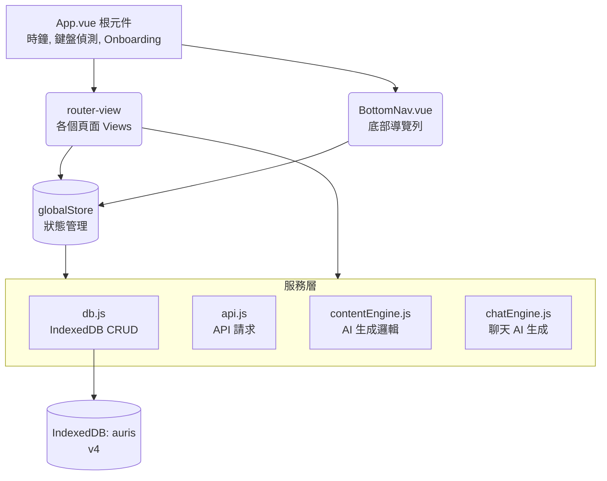

# Auris — 架構規格說明

> 維護這份文件的原則：每次新增頁面、服務、或重要設計決策時一起更新。  
> 最後更新：2026-05-22

---

## 目錄

1. [整體架構](#1-整體架構)
2. [資料流向](#2-資料流向)
3. [IndexedDB 資料庫](#3-indexeddb-資料庫)
4. [Services 服務層](#4-services-服務層)
5. [Store 全局狀態](#5-store-全局狀態)
6. [Router 路由](#6-router-路由)
7. [Views 頁面](#7-views-頁面)
8. [Components 元件與 UI 系統](#8-components-元件與-ui-系統)
9. [CSS 樣式系統](#9-css-樣式系統)
10. [維護注意事項](#10-維護注意事項)
11. [新增頁面標準流程](#11-新增頁面標準流程)

---

## 1. 整體架構



---

## 2. 資料流向

### 頁面讀取資料
1. View `onMounted` 階段
2. 呼叫 `globalStore.loadCharacters()` 更新全局角色列表
3. 呼叫 `dbAll('xxx')` 或 `dbIdx('xxx', ...)` 讀取頁面所需的資料
4. 渲染至畫面

### 使用者操作寫入資料
1. 使用者觸發動作 (e.g. 點擊按鈕)
2. View 方法呼叫 `dbPut('xxx', data)` 寫入 IndexedDB
3. (若角色變動) 呼叫 `globalStore.loadCharacters()`
4. 更新 local ref 以立即反映 UI 變更

### AI 生成流程
1. 使用者點擊「生成」或傳送訊息
2. View 呼叫 `contentEngine` 或 `chatEngine` 相關生成函式
3. 服務層讀取 `getSetting` 取得 API 參數與金鑰
4. 讀取所需角色資料 (`dbGet`) 並組合 Prompt
5. 透過 `fetchWithTimeout` 呼叫外部 API (OpenAI/Anthropic/Google)
6. 解析回應後，透過 `dbPut` 存入 DB
7. 回傳結果，View 將新資料推入畫面列表 (無須重新讀取 DB)

---

## 3. IndexedDB 資料庫

**資料庫名稱**：`auris`　**版本**：v4

| 資料表 | keyPath | 索引 | 說明 |
|--------|---------|------|------|
| `characters` | `id` | `worldId` | 角色完整設定 |
| `messages` | `id` | `charId`, `createdAt` | 單人聊天訊息 |
| `memories` | `id` | `charId` | Heart Voice 心聲記錄 |
| `moments` | `id` | `charId`, `createdAt` | 貼文（含 likes/comments） |
| `diary` | `id` | `charId`, `date` | 日記（`date` 格式：YYYY-MM-DD） |
| `dreams` | `id` | `charId` | 夢境 |
| `worlds` | `id` | — | 多世界（待開發） |
| `groups` | `id` | — | 群組設定 |
| `group_messages` | `id` | `groupId`, `createdAt` | 群組訊息 |
| `notifications` | `id` | `charId`, `createdAt` | 通知記錄 |
| `settings` | `key` | — | 系統設定（key-value） |

### Settings 常用 key

| key | 說明 |
|-----|------|
| `api_key` | API 金鑰 |
| `api_provider` | `'openai'` / `'anthropic'` / `'google'` |
| `api_model` | 模型名稱字串 |
| `api_base` | 自訂 API 位址（空 = 用預設） |
| `theme` | 主題名稱（`cream` / `warm` / `dark` / `gray` / `ocean` / `matcha`） |
| `me_settings` | 使用者自身設定物件（名字、年齡、個性等） |
| `onboarding_done` | `true` = 已完成新手引導 |

> [!WARNING]
> **升版注意**：升版（`version` 數字 +1）只能「新增」資料表或索引，不能修改已有結構。修改已有 store 的結構必須刪掉重建，**會清空該 store 的資料**。

---

## 4. Services 服務層

### `services/db.js`
IndexedDB 的所有讀寫操作都走這裡，絕對不要在 View 裡直接操作原生 `indexedDB`。

| 函式 | 用途 |
|------|------|
| `initDB()` | 開啟/升版資料庫，`main.js` 啟動時呼叫 |
| `dbPut(store, value)` | 新增或更新一筆（keyPath = `id` 或 `key`） |
| `dbGet(store, key)` | 讀取單筆 |
| `dbAll(store)` | 讀取全部 |
| `dbIdx(store, indexName, value)` | 用索引查詢多筆 |
| `dbDel(store, key)` | 刪除單筆 |
| `getSetting(key)` | 讀取 settings |
| `setSetting(key, value)` | 寫入 settings |

### `services/api.js`
API 請求的底層工具。

| 函式 | 用途 |
|------|------|
| `fetchWithTimeout(url, opts, ms)` | 帶逾時設定的 fetch，abort 後拋 `'request_timeout'` |
| `sendLLMRequest(messages, config)` | 統一的 LLM 呼叫入口，自動處理 API 格式差異 |

> [!NOTE]
> **Gemini 相容性**：Gemini 不支援 `frequency_penalty` / `presence_penalty`，`sendLLMRequest` 已內部處理。

### `services/contentEngine.js` 與 `chatEngine.js`
AI 內容與對話生成邏輯：

- `contentEngine.js`：負責生成貼文 (`generatePost`)、日記 (`generateDiary`)、夢境 (`generateDream`) 以及留言回覆 (`generateCommentReply`)。
- `chatEngine.js`：負責處理單人聊天 (`generateAIResponse`) 以及群組聊天 (`generateGroupAIResponse`)。
  - **API Error Handling**：因為考量到使用者可能會使用第三方的 API 代理 (Proxy) 伺服器，部分 Proxy 可能會回傳 Array 格式的錯誤訊息（例如 `[{"error": ...}]`），或是對特定的 `max_tokens` (如 800) 給予異常的靜默截斷 (`finish_reason: length`)。引擎內已實作陣列錯誤捕捉，且針對群組聊天放寬 `max_tokens: 4000` 來增加相容性。當生成發生錯誤或長度為 0 時，會直接以「【系統偵錯】」的 `user` 身分寫入 db，藉此回饋在畫面上供排查。

---

## 5. Store 全局狀態

**檔案**：`store/index.js`  
使用 Vue 3 `reactive()` 實作，不依賴 Pinia 以保持輕量。

```javascript
globalStore = {
  theme: 'cream',          // 當前主題，綁到 App.vue data-theme
  characters: [],          // 所有角色陣列，各頁面共用
  keyboardOffset: 0,       // 鍵盤高度（px），用於 BottomNav 隱藏判斷

  init()             // App.vue onMounted 呼叫
  loadCharacters()   // 重新從 DB 載入 characters（各 View onMounted 呼叫）
}
```

---

## 6. Router 路由

**檔案**：`router/index.js`  
使用 `createWebHistory`（需配合 GitHub Pages 的 404 重導機制）。

| 路由 | name | BottomNav 顯示 |
|------|------|---------------|
| `/` | `home` | ✅ |
| `/chat-list` | `chat-list` | ✅ (對話 tab) |
| `/chat/:id?` | `chat` | ❌ 隱藏 |
| `/moments` | `moments` | ✅ |
| `/post/:id` | `post-detail` | ❌ 隱藏 |
| `/diary` | `diary` | ✅ |
| `/group-list` | `group-list` | ✅ (對話 tab) |
| `/group-room/:id?` | `group-room` | ❌ 隱藏 |
| `/settings` | `settings` | ✅ (我的 tab) |

*(省略部分細節路由，請直接參考 router/index.js)*

---

## 7. Views 頁面

### 頁面標準結構

每個 View 的 `<template>` 都應遵循此架構：

```html
<div class="page active" id="pg-xxx">
  <!-- 頁首 -->
  <div class="ph">
    <div class="ph-back" @click="$router.push('...')">返回</div>
    <div class="ph-title">標題</div>
    <div class="ph-act">右側動作</div>
  </div>

  <!-- 主要內容區 -->
  ...
</div>
```

### 關鍵 View 說明

- **ChatRoomView (單人聊天)**：處理一般對話與 Heart Voice 機制。
- **GroupRoomView (群組聊天)**：處理多角色在同一個房間的對話。
  - *更新狀態 (v1.0.40)*：群組回覆邏輯已完全整合 P36 的歷史資料清洗（精準點名偵測、角色前綴去重）與系統提示詞規則，確保 AI 角色不會互相混淆發言。
- **CharEditView (角色編輯)**：採用 5 個 Tab 切換，必須確保 modal CSS 存在以正常顯示彈窗。

---

## 8. Components 元件與 UI 系統

### `BottomNav.vue`
- 使用 `useRoute()` 判斷當前路由。
- `.kb-hidden`：鍵盤拉起時隱藏整個導覽列，優化手機打字體驗。

### Toast 系統 (`$toast`)
- 取代原生 `window.alert()` 的全域通知系統。
- 在 `App.vue` 實作了 `<div class="global-toast">`。
- 在任何 View 元件中可直接呼叫：`this.$toast('通知訊息')` 或是 `<div @click="$toast('...')">`。
- 外部 JS 檔（如 `chatEngine.js`）可透過 `window.toast_('通知訊息')` 呼叫。

---

## 9. CSS 樣式系統

**主檔**：`assets/main.css`（集中管理所有樣式）

### 主題系統
透過 `[data-theme="xxx"]` 切換 CSS 變數：
```css
[data-theme="cream"] { --bg: #faf8f5; --rose: #c9826a; }
[data-theme="dark"]  { --bg: #1a1a1a; --rose: #e8907a; }
```

### 常用基礎 Class
| Class | 說明 |
|-------|------|
| `.page` | 頁面根容器，設定為滿版及垂直捲動 |
| `.ph` | 頁首 (Page Header) |
| `.empty-cta` | **空狀態的行動按鈕（玫瑰色背景，專屬）** |
| `.btn-primary` | 深色主要按鈕（如聊天發送） |
| `.modal-overlay` / `.modal-box` | 彈窗遮罩與底部升起內容區 |

---

## 10. 維護注意事項

1. **刪除關聯資料**：在刪除角色時，必須同步清除 `messages`, `memories`, `diary`, `dreams`, `moments` 內帶有該 `charId` 的所有資料。
2. **新增設定項目**：直接透過 `setSetting('new_key', value)` 新增即可，不需修改資料庫結構。
3. **空狀態原則**：遇到尚未開發或空列表時，按鈕一律使用 `.empty-cta` 而非 `.btn-primary`，且未完成的功能應掛上 `@click="$toast('尚在開發，敬請期待')"`。

---

## 11. 新增頁面標準流程

1. 建立檔案：`src/views/XxxView.vue`。
2. 註冊路由：在 `router/index.js` 新增路由物件。
3. 控制導覽列：若需隱藏 BottomNav，將路由名稱加入 `App.vue` 的 `hiddenRoutes` 陣列。
4. 設定高光：在 `BottomNav.vue` 中將路由加入對應的 active 判斷邏輯。

---

## 12. 版本更新紀錄

### v0.47 / P46（2026-05-23）

**對話長按選單復刻與 UX 優化：**

- **重構對話編輯流程**（`ChatRoomView.vue`）：導入長按（Touch & Mouse）選單，包含「複製」、「編輯並重傳」、「重新生成回覆」。創新地將編輯模式與輸入框結合，提供可取消的安全編輯體驗。
- **Heart Voice 頻率與 Token 節能**（`chatEngine.js`）：保底間隔從 5 句延長至 15 句，且情緒關鍵字觸發條件降為 30% 機率，有效減少不必要的 Token 消耗並提升文字價值。
- **貼文按鈕優化**（`MomentsView.vue`）：將按鈕文字改為動態帶入角色名稱。
- **系統提示詞防呆**（`chatEngine.js`）：修正 Heart Voice 容易洩漏 `（對話結束，請開始執行任務）` 等底層 Prompt 的問題。

---

### v0.46 / P45（2026-05-23）

**架構統一與核心體驗修復：**

- **重構 `sendLLMRequest` 取代手動 fetch**（`api.js`）：將 P44 放棄的 `sendLLMRequest` 加入 `Array.isArray` 與 `optional chaining` 的容錯機制，使其能完美應付所有 Proxy 與例外狀況。所有內容引擎（包含留言回覆）皆改用單一 `user` 訊息呼叫 `sendLLMRequest`，徹底解決 503 解析錯誤與架構破碎問題。
- **iOS PWA 鍵盤空白徹底修復**（`main.css`, `App.vue`）：遵守 `CLAUDE.md` 原則，將 PWA `body` 加上 `position: fixed; width: 100%`，並移除先前誤加在 `.phone` 的 `paddingBottom`，根治 iOS 鍵盤彈出時下方的白色斷層。
- **初始登入模型選擇**（`OnboardingView.vue`）：在註冊流程第一步新增動態模型選擇下拉選單（連動服務商 `MODELS` 常數），解決原先登入後無法即時選擇模型的缺陷。

---

### v0.45 / P44（2026-05-22）

**根治貼文留言回覆無法生成：**

- **根本原因**（`contentEngine.js`）：`generateCommentReply` 是整個 codebase 裡唯一使用 `sendLLMRequest` 包裝層的函式。所有其他有效函式（`generatePost`、`generateDiary`、`generateDream`、`generateAIResponse`、`generateGroupAIResponse`）都是直接使用 `fetchWithTimeout`。`sendLLMRequest` 有兩個致命問題：① 不處理 Proxy 回傳 Array 格式錯誤（`[{"error":...}]`），其他函式都有 `Array.isArray(d) ? d[0]?.error : d.error` 的保護；② 使用嚴格屬性存取 `data.choices[0].message.content` 而非 optional chaining，在 Proxy 回傳非預期格式時直接崩潰。
- **修法**：完全移除 `sendLLMRequest`，改為與其他所有內容生成函式相同的 `fetchWithTimeout` 直接呼叫模式，分別處理 Anthropic / OpenAI+Google 兩條路徑，加入 `Array.isArray` 錯誤格式保護與 optional chaining。

---

### v0.44 / P43（2026-05-22）

**功能更新：**

- **API 模型列表更新**（`ApiView.vue`）：依官方文件查證（2026-05-22），更新 OpenAI / Anthropic / Google 三家服務商的模型清單至最新版本。
- **自訂模型 ID 支援**（`ApiView.vue`）：在模型列表末端加入「自訂模型」選項，選取後顯示輸入框。`onMounted` 時若已儲存的模型 ID 不在列表中，自動進入自訂模式；`saveApi` 以自訂 ID 寫入 DB，空值時阻止儲存並提示。

---

### v0.43 / P42（2026-05-22）

**修復項目：**

- **夢境月亮位置**（`DreamView.vue`）：移除獨立的 `dream-hero` 月亮，改為空狀態 `bb-empty-ic`，月亮直接在「還沒有夢境紀錄」上方。
- **iOS PWA 鍵盤空白根治**（`main.css`, `App.vue`）：PWA body 加 `position: fixed; width: 100%` 阻止 iOS 捲動 visual viewport；移除 phone 的 `paddingBottom` inline style；加 `focusin` scrollIntoView。
- **留言回覆無法生成根治**（`contentEngine.js`）：`generateCommentReply` 改用 `sendLLMRequest` 統一入口，確保 response 解析與聊天功能一致；修正預設 model `gpt-5.4-mini` → `gpt-4o-mini`。

---

### v1.0.42 / P41（2026-05-22）

**修復項目：**

- **夢境雙月亮**（`DreamView.vue`）：移除空狀態 `bb-empty-ic` 圖示，保留頁首裝飾月亮。
- **貼文留言靜默失敗**（`contentEngine.js`）：`generateCommentReply` 的 API 錯誤原本被 try-catch 吞掉，使用者只看到打字指示器消失。補上 `window.toast_` 提示失敗原因。
- **鍵盤白色空白**（`assets/main.css`）：PWA 模式 `.phone` 原用 `min-height: 100dvh`，動態 `paddingBottom` 只讓容器增高而非縮短內容區。改用 `height: 100dvh; box-sizing: border-box`，讓 `paddingBottom: keyboardOffset` 正確縮短 `.screen` flex 子元素高度。
- **群組只有單人回覆**（`GroupRoomView.vue`）：`sendMsg()` 改為無 @點名時全員依隨機順序依序回覆，各角色間有 800–2000ms 延遲；有 @點名時只有被點名角色回覆。
